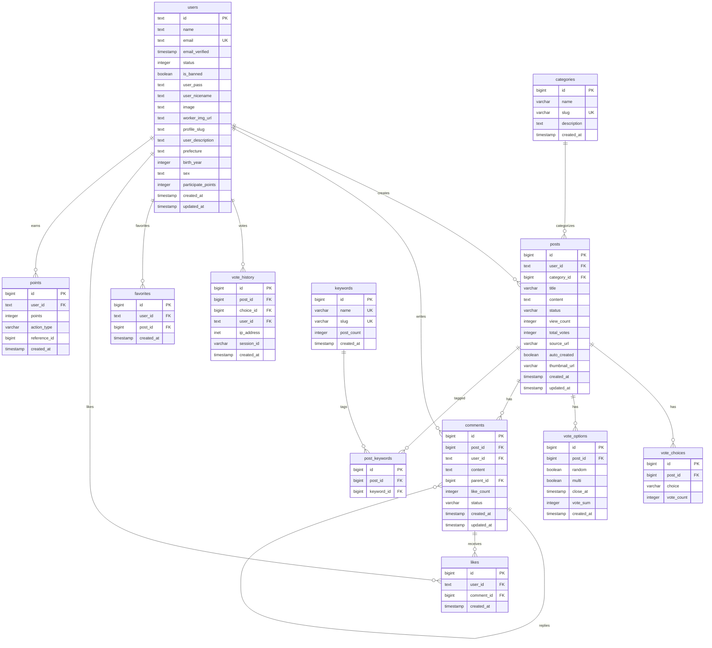

# Anke 完全設計仕様書

**Project**: Anke（アンケ）  
**Version**: 1.0  
**Last Updated**: 2026-02-13  
**Data Source**: Supabase (PostgreSQL)  
**Technology Stack**: Next.js 16 (App Router) + TypeScript + Supabase + TailwindCSS

---

## 📋 目次

1. [プロジェクト概要](#1-プロジェクト概要)
2. [データベース設計](#2-データベース設計)
3. [ファイル構造](#3-ファイル構造)
4. [テーブル詳細定義](#4-テーブル詳細定義)
5. [API仕様](#5-api仕様)
6. [認証システム](#6-認証システム)
7. [運用とデプロイ](#7-運用とデプロイ)

---

## 1. プロジェクト概要

### 1.1 コンセプト

ログイン会員制のアンケート投票サイト。ユーザーがアンケートを投稿し、他のユーザーが投票・コメントできるWebアプリケーション。

### 1.2 主要機能

#### ユーザー機能
- **会員登録・ログイン**: メール・LINE・X（Twitter）でログイン可能
- **アンケート投票**: ユーザーが投稿したアンケートに投票
- **コメント機能**: 投票結果にコメントを投稿・返信
- **いいね機能**: コメントにいいねを付ける
- **ポイントシステム**: 投稿・投票・コメントでポイント獲得
- **お気に入り**: 気になる投稿をお気に入り登録

#### 管理機能
- **投稿管理**: 投稿の一覧・編集・削除
- **ユーザー管理**: ユーザーの一覧・編集・BAN
- **コメント管理**: コメントの一覧・編集・削除
- **AI自動投稿**: OpenAI APIを使用した自動投稿生成
- **AI自動投票・コメント**: 自動アクション機能
- **メール管理**: SMTP設定、テンプレート、送信ログ

### 1.3 技術スタック

| カテゴリ | 技術 |
|---------|------|
| **Frontend** | Next.js 16 (App Router), TypeScript, React 19 |
| **Styling** | TailwindCSS 4, shadcn/ui |
| **Backend** | Next.js API Routes |
| **Database** | Supabase (PostgreSQL 17) |
| **Authentication** | Auth.js (NextAuth.js v5) |
| **Charts** | Recharts |
| **AI** | OpenAI API |
| **Deployment** | カゴヤVPS (Ubuntu + PM2 + Nginx) |

---

## 2. データベース設計

### 2.1 ER図



### 2.2 テーブル一覧（全32テーブル）

| カテゴリ | テーブル名 | 説明 |
|---------|-----------|------|
| **ユーザー** | `users` | ユーザー情報 |
| | `accounts` | NextAuth.jsアカウント連携 |
| | `sessions` | セッション管理 |
| **投稿** | `posts` | 投稿（アンケート） |
| | `categories` | カテゴリ |
| | `keywords` | キーワード |
| | `post_keywords` | 投稿とキーワードの関連 |
| **投票** | `vote_choices` | 投票選択肢 |
| | `vote_options` | 投票設定 |
| | `vote_history` | 投票履歴 |
| **コメント** | `comments` | コメント |
| | `likes` | いいね |
| | `like_counts` | いいね数集計 |
| **お気に入り** | `favorites` | お気に入り |
| **通知** | `notifications` | 通知 |
| **ポイント** | `points` | ポイント履歴 |
| | `point_settings` | ポイント設定 |
| | `points_aggregate_logs` | ポイント集計ログ |
| **ワーカー** | `workers` | ワーカー（アンケート作成依頼） |
| **検索** | `keyword_search_history` | キーワード検索履歴 |
| | `ng_words` | NGワード |
| **AI自動機能** | `auto_creator_settings` | 自動投稿作成設定 |
| | `auto_creator_logs` | 自動投稿作成ログ |
| | `auto_creator_processed` | 処理済みURL |
| | `auto_voter_settings` | 自動投票設定 |
| | `auto_voter_logs` | 自動投票ログ |
| | `auto_tagger_logs` | 自動タグ付けログ |
| **メール** | `mail_settings` | メール設定 |
| | `mail_templates` | メールテンプレート |
| | `mail_logs` | メール送信ログ |
| **システム** | `api_settings` | API設定 |
| | `backup_logs` | バックアップログ |

### 2.3 主要なリレーション

#### 1. ユーザー関連
```
users (1) ←→ (N) accounts
users (1) ←→ (N) sessions
users (1) ←→ (N) posts
users (1) ←→ (N) comments
users (1) ←→ (N) vote_history
users (1) ←→ (N) favorites
users (1) ←→ (N) likes
users (1) ←→ (N) points
users (1) ←→ (N) notifications
```

#### 2. 投稿・投票フロー
```
users → posts (投稿作成)
    ↓
vote_choices (選択肢作成)
    ↓
vote_options (投票設定)
    ↓
vote_history (投票記録)
```

#### 3. コメントフロー
```
users → comments (コメント投稿)
    ↓
comments → comments (返信: parent_id)
    ↓
likes (いいね)
```

### 2.4 テーブル設計の特徴

#### ポイントシステム
- `points`テーブルで獲得履歴を管理
- `users.participate_points`で保有ポイントを集計
- `action_type`で獲得理由を分類（post, vote, comment等）

#### 投票システム
- `vote_choices`: 選択肢と投票数
- `vote_options`: 複数選択可否、ランダム表示、締切日時
- `vote_history`: 投票履歴（ユーザー・IP・セッション）

---

## 3. ファイル構造

### 3.1 ディレクトリ構成

```
anke/
├── src/
│   ├── app/
│   │   ├── layout.tsx                           # ルートレイアウト
│   │   ├── page.tsx                             # トップページ
│   │   ├── globals.css                          # グローバルCSS
│   │   ├── providers.tsx                        # プロバイダー
│   │   ├── not-found.tsx                        # 404ページ
│   │   │
│   │   ├── (admin)/admin/                       # 管理画面グループ
│   │   │   ├── layout.tsx                       # 管理画面レイアウト
│   │   │   ├── page.tsx                         # ダッシュボード
│   │   │   ├── posts/                           # 投稿管理
│   │   │   ├── users/                           # ユーザー管理
│   │   │   ├── comments/                        # コメント管理
│   │   │   ├── categories/                      # カテゴリ管理
│   │   │   ├── keywords/                        # キーワード管理
│   │   │   ├── likes/                           # いいね管理
│   │   │   ├── points/                          # ポイント管理
│   │   │   ├── ng-words/                        # NGワード管理
│   │   │   ├── api-settings/                    # API設定
│   │   │   ├── cleanup/                         # クリーンアップ
│   │   │   ├── ankeworks/                       # アンケワークス管理
│   │   │   ├── auto-creator/                    # AI自動投稿設定
│   │   │   ├── auto-voter-commenter-liker/      # AI自動アクション
│   │   │   └── mail/                            # メール管理
│   │   │       ├── settings/                    # SMTP設定
│   │   │       ├── templates/                   # テンプレート
│   │   │       └── logs/                        # 送信ログ
│   │   │
│   │   ├── (auth)/                              # 認証グループ
│   │   │   ├── login/                           # ログイン
│   │   │   ├── logout/                          # ログアウト
│   │   │   ├── regist/                          # 会員登録
│   │   │   ├── verify/                          # メール認証
│   │   │   ├── password/                        # パスワード関連
│   │   │   └── resetpassword/                   # パスワードリセット
│   │   │
│   │   ├── (user)/                              # ユーザーグループ
│   │   │   ├── mypage/                          # マイページ
│   │   │   ├── myprofile/                       # プロフィール編集
│   │   │   ├── profileset/                      # プロフィール設定
│   │   │   ├── profile/                         # プロフィール表示
│   │   │   ├── myanke/                          # 自分のアンケート
│   │   │   ├── favorites/                       # お気に入り
│   │   │   ├── point/                           # ポイント履歴
│   │   │   ├── phistory/                        # 投稿履歴
│   │   │   ├── inquiry/                         # お問い合わせ
│   │   │   └── report/                          # 通報
│   │   │
│   │   ├── (posts)/                             # 投稿関連グループ
│   │   │   └── posts/[id]/                      # 投稿詳細
│   │   │
│   │   ├── (static)/                            # 静的ページグループ
│   │   │
│   │   ├── ankeworks/                           # アンケワークス
│   │   ├── users/                               # ユーザーページ
│   │   │
│   │   └── api/                                 # APIルート
│   │       ├── auth/                            # 認証API
│   │       ├── password/                        # パスワードAPI
│   │       ├── categories/                      # カテゴリAPI
│   │       ├── notifications/                   # 通知API
│   │       ├── users/                           # ユーザーAPI
│   │       ├── user/                            # ユーザー情報API
│   │       ├── stats/                           # 統計API
│   │       ├── upload-image/                    # 画像アップロード
│   │       ├── cron/                            # CRONタスク
│   │       ├── (admin)/                         # 管理API
│   │       ├── (auto)/                          # 自動処理API
│   │       ├── (posts)/                         # 投稿API
│   │       └── (user)/                          # ユーザー操作API
│   │
│   ├── components/                              # Reactコンポーネント
│   │   ├── Header.tsx                           # ヘッダー
│   │   ├── HeaderClient.tsx                     # ヘッダー（クライアント）
│   │   ├── Footer.tsx                           # フッター
│   │   ├── Sidebar.tsx                          # サイドバー
│   │   ├── HomeRightSidebar.tsx                 # ホームサイドバー
│   │   ├── RightSidebar.tsx                     # 右サイドバー
│   │   ├── MobileLeftSidebar.tsx                # モバイル左サイドバー
│   │   ├── MobileRightSidebar.tsx               # モバイル右サイドバー
│   │   ├── LoginRequired.tsx                    # ログイン必須
│   │   ├── FavoriteButton.tsx                   # お気に入りボタン
│   │   ├── FloatingCreateButton.tsx             # 投稿作成ボタン
│   │   ├── SearchForm.tsx                       # 検索フォーム
│   │   ├── SearchHistory.tsx                    # 検索履歴
│   │   ├── SearchKeywords.tsx                   # 検索キーワード
│   │   ├── KeywordsSection.tsx                  # キーワードセクション
│   │   ├── MyPageMenu.tsx                       # マイページメニュー
│   │   └── ui/                                  # shadcn/uiコンポーネント
│   │
│   ├── hooks/                                   # カスタムフック
│   │
│   ├── lib/                                     # ユーティリティ
│   │   ├── auth.ts                              # Auth.js設定
│   │   ├── supabase.ts                          # Supabaseクライアント
│   │   ├── api.ts                               # API関数
│   │   ├── email.ts                             # メール送信
│   │   ├── chatgpt.ts                           # ChatGPT連携
│   │   ├── favorites.ts                         # お気に入り処理
│   │   ├── keywords.ts                          # キーワード処理
│   │   ├── ngWordCheck.ts                       # NGワードチェック
│   │   ├── getPostsCount.ts                     # 投稿数取得
│   │   ├── wordpress-password.ts                # WPパスワード互換
│   │   └── utils.ts                             # 汎用ユーティリティ
│   │
│   ├── scripts/                                 # スクリプト
│   │
│   ├── supabase/                                # Supabase関連
│   │
│   └── types/                                   # TypeScript型定義
│       └── supabase.ts                          # Supabase型
│
├── docs/                                        # ドキュメント
│   ├── ANKE-COMPLETE-SPECIFICATION.md           # 本ドキュメント
│   └── COMMON-development-environment-mac-mini.md # 共通開発環境（シンボリックリンク）
│
├── supabase/                                    # Supabase設定
│   └── config.toml                              # Supabase設定
│
├── @backups/                                    # データベースバックアップ
├── public/                                      # 静的ファイル
│
├── .env.local                                   # 環境変数（ローカル）
├── .env.example                                 # 環境変数サンプル
├── docker-compose.yml                           # Docker Compose設定
├── next.config.ts                               # Next.js設定
├── package.json                                 # npm依存関係
├── tailwind.config.ts                           # TailwindCSS設定
└── tsconfig.json                                # TypeScript設定
```

### 3.2 主要ファイルの役割

#### コアファイル

| ファイル | 役割 |
|---------|------|
| `src/app/layout.tsx` | ルートレイアウト、ヘッダー/フッター |
| `src/app/page.tsx` | トップページ、投稿一覧 |
| `src/lib/auth.ts` | Auth.js認証設定 |
| `src/lib/supabase.ts` | Supabaseクライアント初期化 |

#### 投稿関連

| ファイル | 役割 |
|---------|------|
| `posts/[id]/page.tsx` | 投稿詳細ページ |
| `posts/[id]/VoteSection.tsx` | 投票UI |
| `posts/[id]/CommentSection.tsx` | コメントUI |

---

## 4. テーブル詳細定義

### 4.1 ユーザー関連

#### `users` — ユーザー情報

```sql
CREATE TABLE users (
  id TEXT PRIMARY KEY,
  name TEXT,
  email TEXT UNIQUE,
  email_verified TIMESTAMP WITH TIME ZONE,
  status INTEGER DEFAULT 0,
  is_banned BOOLEAN DEFAULT false,
  user_pass TEXT,
  user_nicename TEXT,
  image TEXT,
  worker_img_url TEXT,
  profile_slug TEXT,
  user_description TEXT,
  prefecture TEXT,
  birth_year INTEGER,
  sex TEXT,
  participate_points INTEGER DEFAULT 0,
  child_count INTEGER DEFAULT 0,
  marriage TEXT,
  job TEXT,
  sei TEXT,
  mei TEXT,
  kana_sei TEXT,
  kana_mei TEXT,
  email_subscription INTEGER DEFAULT 0,
  interest_categories TEXT,
  profile_registered INTEGER DEFAULT 0,
  sns_x TEXT,
  profile_slug_updated_at TIMESTAMP WITH TIME ZONE,
  reset_token TEXT,
  reset_token_expiry TIMESTAMP WITH TIME ZONE,
  created_at TIMESTAMP WITH TIME ZONE DEFAULT NOW(),
  updated_at TIMESTAMP WITH TIME ZONE DEFAULT NOW()
);

CREATE INDEX idx_users_email ON users(email);
CREATE INDEX idx_users_status ON users(status);
```

**主要カラム**:
- `id`: ユーザーID（TEXT、主キー）
- `email`: ログイン用メールアドレス（一意）
- `status`: ユーザー権限レベル（INTEGER）
  - `0`: 一般ユーザー
  - `1`: メンバー
  - `2`: 編集者
  - `3`: 管理者
  - `6`: AIエディター
- `is_banned`: BAN状態
- `participate_points`: 保有ポイント

**管理者権限チェック**:
- 管理画面アクセス: `status >= 2`（編集者以上）

---

### 4.2 投稿関連

#### `posts` — 投稿（アンケート）

```sql
CREATE TABLE posts (
  id BIGSERIAL PRIMARY KEY,
  user_id TEXT REFERENCES users(id),
  category_id BIGINT REFERENCES categories(id) ON DELETE SET NULL,
  title VARCHAR(500) NOT NULL,
  content TEXT,
  status VARCHAR(20) DEFAULT 'published',
  view_count INTEGER DEFAULT 0,
  total_votes INTEGER DEFAULT 0,
  source_url VARCHAR(500),
  auto_created BOOLEAN DEFAULT false,
  og_title VARCHAR(500),
  og_description TEXT,
  og_image VARCHAR(500),
  thumbnail_url VARCHAR(500),
  workid INTEGER REFERENCES workers(id) ON DELETE SET NULL,
  created_at TIMESTAMP WITH TIME ZONE DEFAULT NOW(),
  updated_at TIMESTAMP WITH TIME ZONE DEFAULT NOW()
);

CREATE INDEX idx_posts_user_id ON posts(user_id);
CREATE INDEX idx_posts_category_id ON posts(category_id);
CREATE INDEX idx_posts_status ON posts(status);
CREATE INDEX idx_posts_created_at ON posts(created_at DESC);
CREATE UNIQUE INDEX idx_posts_source_url ON posts(source_url) WHERE source_url IS NOT NULL;
```

**主要カラム**:
- `title`: アンケートタイトル
- `content`: 本文
- `status`: 公開状態（published/draft/deleted）
- `total_votes`: 総投票数
- `auto_created`: AI自動作成フラグ

---

#### `vote_choices` — 投票選択肢

```sql
CREATE TABLE vote_choices (
  id BIGSERIAL PRIMARY KEY,
  post_id BIGINT REFERENCES posts(id) ON DELETE CASCADE,
  choice VARCHAR(500) NOT NULL,
  vote_count INTEGER DEFAULT 0
);

CREATE INDEX idx_vote_choices_post_id ON vote_choices(post_id);
```

---

#### `vote_options` — 投票設定

```sql
CREATE TABLE vote_options (
  id BIGSERIAL PRIMARY KEY,
  post_id BIGINT REFERENCES posts(id) ON DELETE CASCADE,
  random BOOLEAN DEFAULT false,
  multi BOOLEAN DEFAULT false,
  close_at TIMESTAMP WITH TIME ZONE,
  vote_sum INTEGER DEFAULT 0,
  created_at TIMESTAMP WITH TIME ZONE DEFAULT NOW()
);
```

**主要カラム**:
- `random`: 選択肢をランダム表示
- `multi`: 複数選択可能
- `close_at`: 投票締切日時

---

#### `vote_history` — 投票履歴

```sql
CREATE TABLE vote_history (
  id BIGSERIAL PRIMARY KEY,
  post_id BIGINT REFERENCES posts(id) ON DELETE CASCADE,
  choice_id BIGINT REFERENCES vote_choices(id) ON DELETE CASCADE,
  user_id TEXT REFERENCES users(id),
  ip_address INET,
  session_id VARCHAR(255),
  created_at TIMESTAMP WITH TIME ZONE DEFAULT NOW()
);

CREATE INDEX idx_vote_history_post_id ON vote_history(post_id);
CREATE INDEX idx_vote_history_user_id ON vote_history(user_id);
```

---

### 4.3 コメント関連

#### `comments` — コメント

```sql
CREATE TABLE comments (
  id BIGSERIAL PRIMARY KEY,
  post_id BIGINT REFERENCES posts(id) ON DELETE CASCADE,
  parent_id BIGINT REFERENCES comments(id) ON DELETE CASCADE,
  content TEXT NOT NULL,
  status VARCHAR(20) DEFAULT 'published',
  created_at TIMESTAMP WITH TIME ZONE DEFAULT NOW(),
  user_id TEXT REFERENCES users(id)
);

CREATE INDEX idx_comments_post_id ON comments(post_id);
CREATE INDEX idx_comments_user_id ON comments(user_id);
CREATE INDEX idx_comments_parent_id ON comments(parent_id);
```

**主要カラム**:
- `parent_id`: 返信先コメントID（NULL=トップレベル）
- `like_count`: いいね数

---

### 4.4 カテゴリ・キーワード

#### `categories` — カテゴリ

```sql
CREATE TABLE categories (
  id BIGSERIAL PRIMARY KEY,
  name VARCHAR(100) NOT NULL,
  slug VARCHAR(100) NOT NULL UNIQUE,
  description TEXT,
  icon VARCHAR(100),
  parent_id BIGINT REFERENCES categories(id),
  display_order INTEGER,
  is_active BOOLEAN DEFAULT true,
  is_featured BOOLEAN DEFAULT false,
  created_at TIMESTAMP WITH TIME ZONE DEFAULT NOW(),
  updated_at TIMESTAMP WITH TIME ZONE DEFAULT NOW()
);
```

---

#### `keywords` — キーワード

```sql
CREATE TABLE keywords (
  id BIGSERIAL PRIMARY KEY,
  keyword VARCHAR(100) NOT NULL UNIQUE,
  slug VARCHAR(100) NOT NULL UNIQUE,
  description TEXT,
  keyword_type VARCHAR(50),
  parent_id BIGINT REFERENCES keywords(id),
  display_order INTEGER,
  is_featured BOOLEAN DEFAULT false,
  post_count INTEGER DEFAULT 0,
  search_count INTEGER DEFAULT 0,
  view_count INTEGER DEFAULT 0,
  created_at TIMESTAMP WITH TIME ZONE DEFAULT NOW(),
  updated_at TIMESTAMP WITH TIME ZONE DEFAULT NOW()
);
```

---

#### `post_keywords` — 投稿とキーワードの関連

```sql
CREATE TABLE post_keywords (
  id BIGSERIAL PRIMARY KEY,
  post_id BIGINT REFERENCES posts(id) ON DELETE CASCADE,
  keyword_id BIGINT REFERENCES keywords(id) ON DELETE CASCADE,
  UNIQUE(post_id, keyword_id)
);
```

---

### 4.5 ポイント・通知

#### `points` — ポイント履歴

```sql
CREATE TABLE points (
  id BIGSERIAL PRIMARY KEY,
  points INTEGER,
  reason TEXT,
  created_at TIMESTAMP WITH TIME ZONE DEFAULT NOW(),
  user_id TEXT REFERENCES users(id),
  amount INTEGER,
  type VARCHAR(50),
  description TEXT,
  related_id BIGINT
);

CREATE INDEX idx_points_user_id ON points(user_id);
CREATE INDEX idx_points_type ON points(type);
```

**action_type**:
- `post`: 投稿作成
- `vote`: 投票
- `comment`: コメント
- `receive_vote`: 投票を受けた
- `receive_comment`: コメントを受けた

---

#### `point_settings` — ポイント設定

```sql
CREATE TABLE point_settings (
  id BIGSERIAL PRIMARY KEY,
  point_type VARCHAR(50) NOT NULL UNIQUE,
  point_value INTEGER NOT NULL,
  label VARCHAR(100),
  description TEXT,
  is_active BOOLEAN DEFAULT true,
  display_order INTEGER,
  created_at TIMESTAMP WITH TIME ZONE DEFAULT NOW(),
  updated_at TIMESTAMP WITH TIME ZONE DEFAULT NOW()
);
```

---

### 4.5.1 認証・セッション関連

#### `accounts` — NextAuth.jsアカウント連携

```sql
CREATE TABLE accounts (
  id TEXT PRIMARY KEY,
  user_id TEXT NOT NULL REFERENCES users(id) ON DELETE CASCADE,
  type TEXT NOT NULL,
  provider TEXT NOT NULL,
  provider_account_id TEXT NOT NULL,
  refresh_token TEXT,
  access_token TEXT,
  expires_at BIGINT,
  token_type TEXT,
  scope TEXT,
  id_token TEXT,
  session_state TEXT,
  UNIQUE(provider, provider_account_id)
);

CREATE INDEX idx_accounts_user_id ON accounts(user_id);
```

---

#### `sessions` — セッション管理

```sql
CREATE TABLE sessions (
  id TEXT PRIMARY KEY,
  session_token TEXT NOT NULL UNIQUE,
  user_id TEXT NOT NULL REFERENCES users(id) ON DELETE CASCADE,
  expires TIMESTAMP WITH TIME ZONE NOT NULL
);
```

---

### 4.5.2 通知・検索履歴

#### `notifications` — 通知

```sql
CREATE TABLE notifications (
  id BIGSERIAL PRIMARY KEY,
  user_id TEXT REFERENCES users(id),
  type VARCHAR(50),
  title VARCHAR(255),
  message TEXT,
  link VARCHAR(500),
  is_read BOOLEAN DEFAULT false,
  created_at TIMESTAMP WITH TIME ZONE DEFAULT NOW(),
  read_at TIMESTAMP WITH TIME ZONE
);

CREATE INDEX idx_notifications_user_id ON notifications(user_id);
CREATE INDEX idx_notifications_is_read ON notifications(is_read);
```

---

#### `keyword_search_history` — キーワード検索履歴

```sql
CREATE TABLE keyword_search_history (
  id BIGSERIAL PRIMARY KEY,
  user_id TEXT,
  search_keyword VARCHAR(255),
  search_type VARCHAR(50),
  result_count INTEGER,
  created_at TIMESTAMP WITH TIME ZONE DEFAULT NOW()
);

CREATE INDEX idx_keyword_search_history_user_id ON keyword_search_history(user_id);
```

---

### 4.5.3 いいね・お気に入り

#### `likes` — いいね

```sql
CREATE TABLE likes (
  id BIGSERIAL PRIMARY KEY,
  like_type VARCHAR(50),
  target_id BIGINT,
  created_at TIMESTAMP WITH TIME ZONE DEFAULT NOW(),
  user_id TEXT REFERENCES users(id)
);

CREATE INDEX idx_likes_user_id ON likes(user_id);
CREATE INDEX idx_likes_target_id ON likes(target_id);
```

---

#### `like_counts` — いいね数集計

```sql
CREATE TABLE like_counts (
  target_id BIGINT PRIMARY KEY,
  like_type VARCHAR(50),
  like_count INTEGER DEFAULT 0,
  updated_at TIMESTAMP WITH TIME ZONE DEFAULT NOW()
);
```

---

#### `favorites` — お気に入り

```sql
CREATE TABLE favorites (
  id BIGSERIAL PRIMARY KEY,
  user_id TEXT REFERENCES users(id) ON DELETE CASCADE,
  post_id BIGINT REFERENCES posts(id) ON DELETE CASCADE,
  created_at TIMESTAMP WITH TIME ZONE DEFAULT NOW(),
  UNIQUE(user_id, post_id)
);

CREATE INDEX idx_favorites_user_id ON favorites(user_id);
CREATE INDEX idx_favorites_post_id ON favorites(post_id);
```

---

### 4.5.4 ワーカー・NGワード

#### `workers` — ワーカー（アンケート作成依頼）

```sql
CREATE TABLE workers (
  id BIGSERIAL PRIMARY KEY,
  title VARCHAR(500) NOT NULL,
  content TEXT,
  user_id BIGINT,
  status VARCHAR(20) DEFAULT 'published',
  vote_per_price INTEGER DEFAULT 10,
  vote_budget INTEGER DEFAULT 0,
  guest_check BOOLEAN DEFAULT false,
  created_at TIMESTAMP WITH TIME ZONE DEFAULT NOW(),
  updated_at TIMESTAMP WITH TIME ZONE DEFAULT NOW()
);

CREATE INDEX idx_workers_user_id ON workers(user_id);
CREATE INDEX idx_workers_status ON workers(status);
CREATE INDEX idx_workers_created_at ON workers(created_at DESC);
```

**主要カラム**:
- `vote_per_price`: 1票あたりの報酬ポイント
- `vote_budget`: 残予算（ポイント）
- `guest_check`: ゲストユーザーの投票を許可するか

---

#### `ng_words` — NGワード

```sql
CREATE TABLE ng_words (
  id BIGSERIAL PRIMARY KEY,
  word VARCHAR(255) NOT NULL,
  word_type VARCHAR(50),
  severity INTEGER,
  category VARCHAR(100),
  is_active BOOLEAN DEFAULT true,
  created_by TEXT,
  created_at TIMESTAMP WITH TIME ZONE DEFAULT NOW(),
  updated_at TIMESTAMP WITH TIME ZONE DEFAULT NOW()
);
```

---

### 4.6 AI自動機能

#### `auto_creator_settings` — 自動投稿作成設定

```sql
CREATE TABLE auto_creator_settings (
  id BIGSERIAL PRIMARY KEY,
  is_active BOOLEAN DEFAULT false,
  interval_minutes INTEGER DEFAULT 60,
  prompt_template TEXT,
  category_id BIGINT REFERENCES categories(id),
  user_id TEXT REFERENCES users(id),
  created_at TIMESTAMP WITH TIME ZONE DEFAULT NOW(),
  updated_at TIMESTAMP WITH TIME ZONE DEFAULT NOW()
);
```

---

#### `auto_creator_logs` — 自動投稿作成ログ

```sql
CREATE TABLE auto_creator_logs (
  id BIGSERIAL PRIMARY KEY,
  status VARCHAR(20) NOT NULL,
  post_id BIGINT REFERENCES posts(id),
  error_message TEXT,
  execution_time_ms INTEGER,
  created_at TIMESTAMP WITH TIME ZONE DEFAULT NOW()
);
```

---

#### `auto_creator_processed` — 処理済みURL

```sql
CREATE TABLE auto_creator_processed (
  id BIGSERIAL PRIMARY KEY,
  url VARCHAR(500) NOT NULL UNIQUE,
  title VARCHAR(500),
  processed_at TIMESTAMP WITH TIME ZONE DEFAULT NOW()
);
```

---

#### `auto_voter_settings` — 自動投票設定

```sql
CREATE TABLE auto_voter_settings (
  id BIGSERIAL PRIMARY KEY,
  setting_key VARCHAR(100) NOT NULL,
  setting_value TEXT,
  created_at TIMESTAMP WITH TIME ZONE DEFAULT NOW(),
  updated_at TIMESTAMP WITH TIME ZONE DEFAULT NOW()
);
```

---

#### `auto_voter_logs` — 自動投票ログ

```sql
CREATE TABLE auto_voter_logs (
  id BIGSERIAL PRIMARY KEY,
  execution_type VARCHAR(50),
  status VARCHAR(20) NOT NULL,
  action_type VARCHAR(50),
  post_id BIGINT,
  user_id TEXT,
  message TEXT,
  error_message TEXT,
  created_at TIMESTAMP WITH TIME ZONE DEFAULT NOW()
);
```

---

#### `auto_tagger_logs` — 自動タグ付けログ

```sql
CREATE TABLE auto_tagger_logs (
  id BIGSERIAL PRIMARY KEY,
  status VARCHAR(20) NOT NULL,
  post_id BIGINT REFERENCES posts(id),
  message TEXT,
  error_message TEXT,
  created_at TIMESTAMP WITH TIME ZONE DEFAULT NOW()
);
```

---

### 4.7 メール関連

#### `mail_settings` — メール設定

```sql
CREATE TABLE mail_settings (
  id BIGSERIAL PRIMARY KEY,
  smtp_host TEXT,
  smtp_port INTEGER,
  smtp_user TEXT,
  smtp_pass TEXT,
  use_ssl BOOLEAN DEFAULT true,
  from_email TEXT,
  from_name TEXT,
  is_active BOOLEAN DEFAULT true,
  created_at TIMESTAMP WITH TIME ZONE DEFAULT NOW(),
  updated_at TIMESTAMP WITH TIME ZONE DEFAULT NOW()
);
```

---

#### `mail_templates` — メールテンプレート

```sql
CREATE TABLE mail_templates (
  id BIGSERIAL PRIMARY KEY,
  template_key TEXT NOT NULL UNIQUE,
  subject TEXT,
  body TEXT,
  is_active BOOLEAN DEFAULT true,
  created_at TIMESTAMP WITH TIME ZONE DEFAULT NOW(),
  updated_at TIMESTAMP WITH TIME ZONE DEFAULT NOW(),
  description TEXT
);
```

---

#### `mail_logs` — メール送信ログ

```sql
CREATE TABLE mail_logs (
  id BIGSERIAL PRIMARY KEY,
  template_key VARCHAR(100),
  to_email TEXT,
  from_email TEXT,
  subject TEXT,
  body TEXT,
  status VARCHAR(20),
  error_message TEXT,
  sent_at TIMESTAMP WITH TIME ZONE,
  created_at TIMESTAMP WITH TIME ZONE DEFAULT NOW()
);
```

---

### 4.8 システム管理

#### `api_settings` — API設定

```sql
CREATE TABLE api_settings (
  id BIGSERIAL PRIMARY KEY,
  api_name VARCHAR(100) NOT NULL,
  api_key TEXT,
  api_secret TEXT,
  endpoint_url TEXT,
  is_active BOOLEAN DEFAULT true,
  created_at TIMESTAMP WITH TIME ZONE DEFAULT NOW(),
  updated_at TIMESTAMP WITH TIME ZONE DEFAULT NOW()
);
```

---

#### `backup_logs` — バックアップログ

```sql
CREATE TABLE backup_logs (
  id BIGSERIAL PRIMARY KEY,
  status VARCHAR(20),
  message TEXT,
  error_message TEXT,
  file_path VARCHAR(500),
  file_size BIGINT,
  created_at TIMESTAMP WITH TIME ZONE DEFAULT NOW()
);
```

---

#### `points_aggregate_logs` — ポイント集計ログ

```sql
CREATE TABLE points_aggregate_logs (
  id BIGSERIAL PRIMARY KEY,
  status VARCHAR(50),
  message TEXT,
  error_message TEXT,
  users_processed INTEGER,
  created_at TIMESTAMP WITH TIME ZONE DEFAULT NOW()
);

CREATE INDEX idx_points_aggregate_logs_created_at ON points_aggregate_logs(created_at DESC);
```

---

## 5. API仕様

### 5.1 認証API

| エンドポイント | メソッド | 説明 |
|---------------|---------|------|
| `/api/auth/[...nextauth]` | ALL | Auth.js認証ハンドラ |
| `/api/auth/register` | POST | 会員登録 |
| `/api/auth/verify` | POST | メール認証 |
| `/api/password/reset` | POST | パスワードリセット要求 |
| `/api/password/reset/confirm` | POST | パスワードリセット確認 |
| `/api/password/change` | POST | パスワード変更 |

### 5.2 投稿API

| エンドポイント | メソッド | 説明 |
|---------------|---------|------|
| `/api/posts/latest` | GET | 最新投稿取得 |
| `/api/post-create` | POST | 投稿作成 |
| `/api/post-edit` | PUT | 投稿編集 |
| `/api/post-delete` | DELETE | 投稿削除 |

### 5.3 投票・コメントAPI

| エンドポイント | メソッド | 説明 |
|---------------|---------|------|
| `/api/vote` | POST | 投票 |
| `/api/comments` | GET/POST | コメント取得/投稿 |
| `/api/comment-likes` | POST | コメントいいね |

### 5.4 ユーザーAPI

| エンドポイント | メソッド | 説明 |
|---------------|---------|------|
| `/api/favorites` | GET | お気に入り一覧 |
| `/api/favorites/toggle` | POST | お気に入り切替 |
| `/api/favorites/check` | GET | お気に入り確認 |
| `/api/mypage` | GET | マイページデータ |
| `/api/profileset` | PUT | プロフィール更新 |

### 5.5 管理API

| エンドポイント | メソッド | 説明 |
|---------------|---------|------|
| `/api/admin/posts` | GET | 投稿一覧取得 |
| `/api/admin/posts/[id]/update` | PUT | 投稿更新 |
| `/api/admin/posts/bulk-delete` | DELETE | 投稿一括削除 |
| `/api/admin/users` | GET | ユーザー一覧取得 |
| `/api/admin/auto-creator` | POST | 自動投稿実行 |

---

## 6. 認証システム

### 6.1 対応プロバイダー

| プロバイダー | 設定ファイル |
|-------------|-------------|
| メール/パスワード | `src/lib/auth.ts` |
| LINE | LINE Developers Console |
| X (Twitter) | X Developer Portal |

### 6.2 LINE OAuth設定

1. LINE Developers Console (https://developers.line.biz/console/) でチャネル作成
2. **Callback URL**: `https://anke.jp/api/auth/callback/line`
3. **スコープ**: `profile`, `openid`, `email`

**環境変数**:
```env
LINE_CHANNEL_ID=your_channel_id
LINE_CHANNEL_SECRET=your_channel_secret
LINE_REDIRECT_URI=https://anke.jp/api/auth/callback/line
```

### 6.3 X (Twitter) OAuth設定

1. X Developer Portal (https://developer.twitter.com/) でアプリ作成
2. **Callback URL**: `https://anke.jp/api/auth/callback/twitter`
3. **App permissions**: Read and write

**環境変数**:
```env
TWITTER_CLIENT_ID=your_client_id
TWITTER_CLIENT_SECRET=your_client_secret
TWITTER_REDIRECT_URI=https://anke.jp/api/auth/callback/twitter
```

### 6.4 ユーザーロール

| status | 役割 | 権限 |
|--------|------|------|
| 0 | 一般ユーザー | 閲覧、投票、コメント |
| 1 | メンバー | 投稿作成 |
| 2 | 編集者 | 投稿編集、コメント管理 |
| 3 | 管理者 | 全機能アクセス |
| 6 | AIエディター | AI自動投稿 |

---

## 7. 運用とデプロイ

### 7.1 本番環境構成

```
カゴヤVPS (Ubuntu)
├── Nginx (リバースプロキシ)
│   └── SSL (Let's Encrypt)
├── PM2 (プロセス管理)
│   └── Next.js (standalone)
├── Docker
│   └── Supabase (PostgreSQL)
└── CRON (定期タスク)
    └── AI自動投稿
```

### 7.2 VPS接続情報

- **IPアドレス**: `133.18.122.123`
- **ユーザー名**: `ubuntu`
- **SSH鍵**: `~/.ssh/anke-nextjs.key`
- **アプリケーションパス**: `/var/www/anke-nextjs`

```bash
# SSH接続
ssh -i ~/.ssh/anke-nextjs.key ubuntu@133.18.122.123
```

### 7.3 デプロイ手順

```bash
# 1. ローカルでコミット・プッシュ
git add .
git commit -m "変更内容"
git push origin main

# 2. VPSでデプロイ
ssh -i ~/.ssh/anke-nextjs.key ubuntu@133.18.122.123
cd /var/www/anke-nextjs
pm2 stop anke-nextjs
git pull origin main
npm install
rm -rf .next
npm run build
cp -r public .next/standalone/
cp -r .next/static .next/standalone/.next/
pm2 restart anke-nextjs
```

### 7.4 バックアップ

```bash
# フルバックアップ
docker exec supabase_db_anke pg_dump -U postgres -d postgres --clean --if-exists > @backups/db_full_$(date +%Y%m%d_%H%M%S).sql

# 復元
docker exec -i supabase_db_anke psql -U postgres -d postgres < @backups/db_full_YYYYMMDD_HHMMSS.sql
```

### 7.5 環境変数

**必須環境変数**:
```env
# Supabase
NEXT_PUBLIC_SUPABASE_URL=https://your-project.supabase.co
NEXT_PUBLIC_SUPABASE_ANON_KEY=your_anon_key
SUPABASE_SERVICE_ROLE_KEY=your_service_role_key

# Auth.js
AUTH_SECRET=your_auth_secret
AUTH_TRUST_HOST=true
NEXTAUTH_URL=https://anke.jp
AUTH_URL=https://anke.jp
NEXT_PUBLIC_APP_URL=https://anke.jp

# OAuth
LINE_CHANNEL_ID=your_line_channel_id
LINE_CHANNEL_SECRET=your_line_channel_secret
TWITTER_CLIENT_ID=your_twitter_client_id
TWITTER_CLIENT_SECRET=your_twitter_client_secret

# OpenAI (AI機能用)
OPENAI_API_KEY=your_openai_api_key

# CRON
API_SECRET=your_api_secret
```

---

## 📚 参考リンク

- [Next.js Documentation](https://nextjs.org/docs)
- [Supabase Documentation](https://supabase.com/docs)
- [Auth.js Documentation](https://authjs.dev/)
- [Tailwind CSS Documentation](https://tailwindcss.com/docs)
- [shadcn/ui](https://ui.shadcn.com/)
- [LINE Login Documentation](https://developers.line.biz/ja/docs/line-login/)
- [X API Documentation](https://developer.twitter.com/en/docs)

---

**開発環境のセットアップについては `COMMON-development-environment-mac-mini.md` を参照してください。**

---

最終更新: 2026年2月13日
