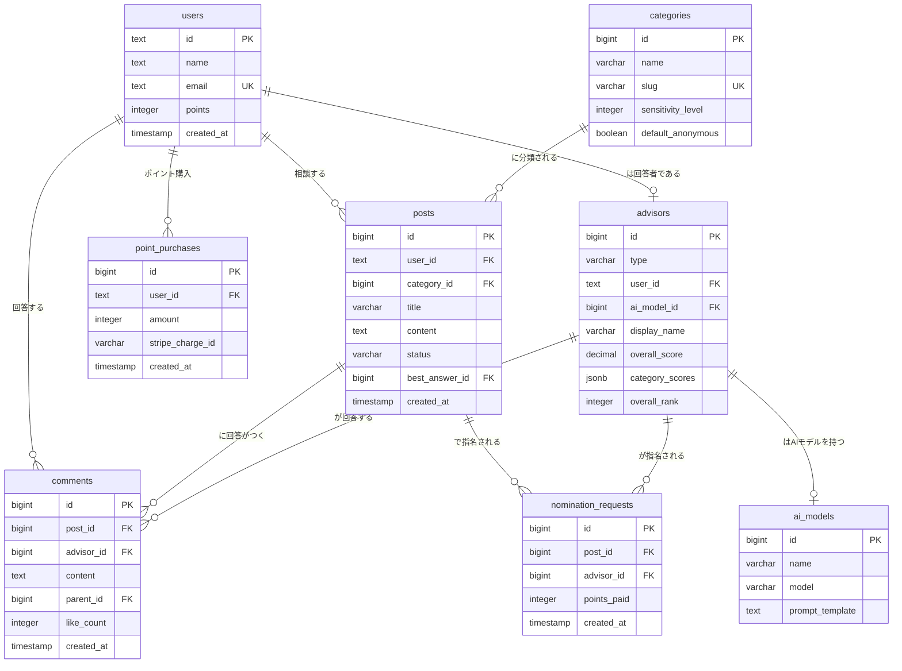

# ハナシテ 完全設計仕様書

**Project**: Hanashite（ハナシテ）  
**Version**: 2.0  
**Last Updated**: 2026-02-26  
**Base System**: Anke v1.0（大幅改修済み）
**Technology Stack**: Next.js 16 (App Router) + TypeScript + Supabase (PostgreSQL 17) + TailwindCSS 4 + shadcn/ui
**Production URL**: https://dokujo.com

---

## 📋 目次

1. [プロジェクト概要](#1-プロジェクト概要)
2. [アーキテクチャ](#2-アーキテクチャ)
3. [データベース設計](#3-データベース設計)
4. [実装済み機能一覧](#4-実装済み機能一覧)
5. [ディレクトリ構成](#5-ディレクトリ構成)
6. [API仕様](#6-api仕様)
7. [主要機能仕様](#7-主要機能仕様)
8. [認証・セキュリティ](#8-認証セキュリティ)
9. [メールサーバー](#9-メールサーバー)
10. [開発・運用](#10-開発運用)

---

## 1. プロジェクト概要

### 1.1 コンセプト

「ハナシテ」は、恋愛・結婚・人間関係の悩みに特化した総合相談プラットフォームです。

**現在の実装状況:**
- ✅ **相談投稿・回答システム**: ユーザーが相談を投稿し、他のユーザーが回答できる基本機能を実装済み
- ✅ **ベストアンサー機能**: 相談者が最も役立った回答を選出できる
- ✅ **カテゴリ別分類**: 恋愛、結婚、復縁、不倫など、カテゴリ別に相談を分類
- ✅ **通知システム**: コメント、返信、ベストアンサー選出時に通知
- ✅ **お気に入り機能**: 気になる相談をブックマーク
- ✅ **通報機能**: 不適切な投稿・コメントを通報
- ✅ **問い合わせフォーム**: LINE/X OAuth対応、返信先メールアドレス入力
- ✅ **メールサーバー**: info@dokujo.com でのメール送受信（Postfix + Dovecot + OpenDKIM）

**今後の拡張予定:**
- ⏳ **AIアドバイザー**: GPT-4を活用した自動回答機能
- ⏳ **ポイントシステム**: 相談投稿・回答にポイントを導入
- ⏳ **回答者ランキング**: AIと人間を統合したランキングシステム

### 1.2 サービスURL

- **本番環境**: https://dokujo.com
- **管理画面**: https://dokujo.com/admin
- **メールアドレス**: info@dokujo.com
- **Supabase**: https://supabase.com/dashboard/project/kivouyapcazzbccrjeqx

### 1.3 ビジネスモデル（今後の展開）

- **ポイントシステム**: 相談者がポイントを購入・消費し、優れた回答者（AI/人間）がポイントを獲得する経済圏を構築
- **占い連携**: AI占いやアフィリエイトを通じて、高単価な占いサービスへ送客
- **アフィリエイト**: 探偵事務所や弁護士事務所など、悩みに応じた高単価なアフィリエイトを導入

---

## 2. アーキテクチャ

Anke v1.0のアーキテクチャを継承し、堅牢性と拡張性を両立させます。

| カテゴリ | 技術 | 備考 |
|---|---|---|
| **Frontend** | Next.js 16.1.0 (App Router), TypeScript, React 19 | ✅ 実装済み |
| **Styling** | TailwindCSS 4, shadcn/ui | ✅ 実装済み |
| **Backend** | Next.js API Routes | ✅ 実装済み |
| **Database** | Supabase (PostgreSQL 17) | ✅ 実装済み |
| **Authentication** | Auth.js (NextAuth.js v5) + LINE/X OAuth | ✅ 実装済み |
| **Email** | Postfix + Dovecot + OpenDKIM | ✅ 実装済み |
| **Charts** | Recharts | ✅ 実装済み |
| **AI** | OpenAI API (GPT-4o-mini) | ⏳ 一部実装 |
| **Payment** | Stripe API | ⏳ 未実装 |
| **Deployment** | カゴヤVPS (Ubuntu 24.04 + PM2 + Nginx) | ✅ 実装済み |
| **Server** | 133.18.125.19 (mail.dokujo.com) | ✅ 稼働中 |

---

## 3. データベース設計

Ankeのデータベーススキーマをベースに、「ハナシテ」の独自機能に合わせてテーブルの追加・変更・削除を行います。

### 3.1 ER図



### 3.2 テーブル一覧（32テーブル）

本番Supabaseで実際に使用されているテーブル一覧（32テーブル）。

| カテゴリ | テーブル名 | 説明 |
|---|---|---|
| **認証・ユーザー** | `users` | ユーザー情報。 |
| | `accounts` | NextAuth.jsアカウント連携。 |
| | `sessions` | セッション管理。 |
| | `verification_tokens` | NextAuth.js用トークン。 |
| **相談** | `posts` | 相談投稿。 |
| | `comments` | コメント・回答。 |
| | `likes` | いいね。 |
| | `like_counts` | いいね集計テーブル。 |
| | `favorites` | お気に入り相談。 |
| **カテゴリ・キーワード** | `categories` | 相談カテゴリ。 |
| | `keywords` | キーワード。 |
| | `post_keywords` | 投稿とキーワードの関連。 |
| **投票機能** | `vote_options` | 投票オプション設定。 |
| | `vote_choices` | 投票選択肢。 |
| | `vote_history` | 投票履歴。 |
| **ポイント** | `points` | ポイント履歴。 |
| | `point_settings` | ポイント設定。 |
| | `points_aggregate_logs` | ポイント集計ログ。 |
| **通知** | `notification_reads` | 通知既読管理。 |
| **検索** | `keyword_search_history` | キーワード検索履歴。 |
| **モデレーション** | `ng_words` | NGワード。 |
| **自動投稿・自動コメント** | `auto_creator_settings` | AI自動投稿設定。 |
| | `auto_creator_processed` | 自動投稿処理済み記事。 |
| | `auto_creator_logs` | 自動投稿ログ。 |
| | `auto_tagger_logs` | 自動タグ付けログ。 |
| | `auto_voter_settings` | AI自動コメント・いいね設定。 |
| | `auto_voter_logs` | 自動コメント・いいねログ。 |
| **メール** | `mail_settings` | メール設定。 |
| | `mail_templates` | メールテンプレート。 |
| | `mail_logs` | メール送信ログ。 |
| **システム** | `api_settings` | API設定。 |
| | `backup_logs` | バックアップログ。 |

---

## 4. 実装済み機能一覧

### 4.1 認証・ユーザー管理

| 機能 | 状態 | 説明 |
|------|------|------|
| メール/パスワード認証 | ✅ | NextAuth.js v5による実装 |
| LINE OAuth | ✅ | ダミーメールアドレス自動生成 |
| X (Twitter) OAuth | ✅ | ダミーメールアドレス自動生成 |
| パスワードリセット | ✅ | メールテンプレート対応 |
| プロフィール編集 | ✅ | アバター、ニックネーム、自己紹介 |
| DiceBear アバター | ✅ | カスタムアバター生成 |

### 4.2 相談・回答機能

| 機能 | 状態 | 説明 |
|------|------|------|
| 相談投稿 | ✅ | タイトル、本文、カテゴリ選択 |
| 画像アップロード | ✅ | 相談投稿時の画像添付 |
| コメント投稿 | ✅ | 3階層までのネスト対応 |
| ベストアンサー選出 | ✅ | 相談者が選出、締め切り機能 |
| いいね機能 | ✅ | コメントへの評価 |
| お気に入り | ✅ | 相談のブックマーク |
| カテゴリ別表示 | ✅ | 恋愛、結婚、復縁など |
| キーワード検索 | ✅ | 全文検索対応 |

### 4.3 通知・コミュニケーション

| 機能 | 状態 | 説明 |
|------|------|------|
| コメント通知 | ✅ | 自分の投稿へのコメント |
| 返信通知 | ✅ | 自分のコメントへの返信 |
| ベストアンサー通知 | ✅ | ベストアンサー選出時 |
| 運営からのお知らせ | ✅ | 管理者投稿の通知 |
| 全既読機能 | ✅ | 通知の一括既読 |
| 未読バッジ | ✅ | ヘッダーに未読数表示 |

### 4.4 モデレーション

| 機能 | 状態 | 説明 |
|------|------|------|
| 通報機能 | ✅ | 投稿・コメントの通報 |
| 通報フォーム | ✅ | URL自動入力、理由選択 |
| 問い合わせフォーム | ✅ | 返信先メール入力対応 |
| NGワード | ✅ | 投稿時の自動フィルタリング |

### 4.5 管理機能

| 機能 | 状態 | 説明 |
|------|------|------|
| 管理画面 | ✅ | ダッシュボード |
| 投稿管理 | ✅ | 編集、削除、ステータス変更 |
| ユーザー管理 | ✅ | 検索、編集、BAN |
| コメント管理 | ✅ | 承認、削除 |
| カテゴリ管理 | ✅ | CRUD操作 |
| メールテンプレート | ✅ | 問い合わせ、パスワードリセット |

### 4.6 メールシステム

| 機能 | 状態 | 説明 |
|------|------|------|
| Postfix (SMTP) | ✅ | メール送信サーバー |
| Dovecot (POP3/IMAP) | ✅ | メール受信サーバー |
| OpenDKIM | ✅ | DKIM署名 |
| Let's Encrypt SSL | ✅ | TLS/SSL証明書 |
| SPF/DKIM/DMARC | ⚠️ | SPF/DKIM設定済み、DMARC未設定 |
| Gmail POP3受信 | ✅ | 動作確認済み |

### 4.7 未実装機能（今後の予定）

| 機能 | 優先度 | 説明 |
|------|--------|------|
| AIアドバイザー | 高 | GPT-4による自動回答 |
| ポイントシステム | 高 | 相談・回答のポイント化 |
| Stripe決済 | 高 | ポイント購入 |
| 回答者ランキング | 中 | AI/人間統合ランキング |
| 占い機能 | 中 | AI占い、アフィリエイト |
| アフィリエイト | 低 | 探偵、弁護士など |

---

## 5. テーブル詳細定義

Ankeのスキーマをベースに、「ハナシテ」用に変更・追加した主要なテーブルを定義します。

### 4.1 `users` — ユーザー

- `participate_points` カラムを `points` にリネームし、保有ポイントを管理。

```sql
CREATE TABLE users (
  id TEXT PRIMARY KEY, -- Auth.jsのユーザーID
  name VARCHAR(100),
  email VARCHAR(255) UNIQUE,
  email_verified TIMESTAMP,
  image TEXT,
  points INTEGER DEFAULT 100, -- 保有ポイント（初期値100pt）
  is_banned BOOLEAN DEFAULT false,
  created_at TIMESTAMP WITH TIME ZONE DEFAULT NOW(),
  updated_at TIMESTAMP WITH TIME ZONE DEFAULT NOW()
);
```

### 4.2 `posts` — 相談

- `vote_` 関連のカラムを削除。
- `best_answer_id` を追加し、ベストアンサーの回答IDを保持。

```sql
CREATE TABLE posts (
  id BIGSERIAL PRIMARY KEY,
  user_id TEXT REFERENCES users(id) ON DELETE SET NULL,
  category_id BIGINT REFERENCES categories(id) ON DELETE SET NULL,
  title VARCHAR(255) NOT NULL,
  content TEXT NOT NULL,
  status VARCHAR(20) DEFAULT 'published', -- published, closed, deleted
  best_answer_id BIGINT REFERENCES comments(id) ON DELETE SET NULL,
  view_count INTEGER DEFAULT 0,
  comment_count INTEGER DEFAULT 0,
  is_anonymous BOOLEAN DEFAULT false,
  created_at TIMESTAMP WITH TIME ZONE DEFAULT NOW(),
  updated_at TIMESTAMP WITH TIME ZONE DEFAULT NOW()
);
```

### 4.3 `comments` — 回答

- `user_id` の代わりに `advisor_id` を使用し、AIか人間かを区別なく参照。

```sql
CREATE TABLE comments (
  id BIGSERIAL PRIMARY KEY,
  post_id BIGINT REFERENCES posts(id) ON DELETE CASCADE,
  advisor_id BIGINT REFERENCES advisors(id) ON DELETE SET NULL,
  content TEXT NOT NULL,
  parent_id BIGINT REFERENCES comments(id) ON DELETE CASCADE,
  like_count INTEGER DEFAULT 0,
  status VARCHAR(20) DEFAULT 'published',
  created_at TIMESTAMP WITH TIME ZONE DEFAULT NOW(),
  updated_at TIMESTAMP WITH TIME ZONE DEFAULT NOW()
);
```

### 4.4 `advisors` — 回答者マスタ（新規）

- AIと人間を統合管理するテーブル。

```sql
CREATE TABLE advisors (
  id BIGSERIAL PRIMARY KEY,
  type VARCHAR(20) NOT NULL, -- 'ai' or 'human'
  user_id TEXT REFERENCES users(id) ON DELETE CASCADE, -- 人間の場合
  ai_model_id BIGINT REFERENCES ai_models(id) ON DELETE CASCADE, -- AIの場合
  display_name VARCHAR(100) NOT NULL,
  bio TEXT,
  icon_url VARCHAR(255),
  
  -- 統一評価指標
  total_answers INTEGER DEFAULT 0,
  best_answers INTEGER DEFAULT 0,
  best_answer_rate DECIMAL(5,2) DEFAULT 0,
  helpful_count INTEGER DEFAULT 0,
  overall_score DECIMAL(5,2) DEFAULT 0,
  
  -- カテゴリ別スコア
  category_scores JSONB,
  
  -- ランキング
  overall_rank INTEGER,
  category_ranks JSONB,
  
  -- 称号
  badges TEXT[],
  
  created_at TIMESTAMP WITH TIME ZONE DEFAULT NOW(),
  updated_at TIMESTAMP WITH TIME ZONE DEFAULT NOW()
);
```

### 4.5 `ai_models` — AIモデル（新規）

- AIアドバイザーの定義を管理。

```sql
CREATE TABLE ai_models (
  id BIGSERIAL PRIMARY KEY,
  name VARCHAR(100) NOT NULL, -- 例: AI-恋愛マスター
  model VARCHAR(50) NOT NULL, -- 例: gpt-4.1-mini
  prompt_template TEXT NOT NULL,
  is_active BOOLEAN DEFAULT true,
  created_at TIMESTAMP WITH TIME ZONE DEFAULT NOW(),
  updated_at TIMESTAMP WITH TIME ZONE DEFAULT NOW()
);
```

### 4.6 `categories` — 相談カテゴリ

- 恋愛相談に特化し、センシティブ度を追加。

```sql
CREATE TABLE categories (
  id BIGSERIAL PRIMARY KEY,
  name VARCHAR(100) NOT NULL,
  slug VARCHAR(100) NOT NULL UNIQUE,
  description TEXT,
  parent_id BIGINT REFERENCES categories(id),
  display_order INTEGER,
  sensitivity_level INTEGER DEFAULT 1, -- 1-5
  default_anonymous BOOLEAN DEFAULT false,
  is_active BOOLEAN DEFAULT true,
  created_at TIMESTAMP WITH TIME ZONE DEFAULT NOW(),
  updated_at TIMESTAMP WITH TIME ZONE DEFAULT NOW()
);
```

### 4.7 `points` — ポイント履歴

- `type` を「ハナシテ」の仕様に変更。

```sql
CREATE TABLE points (
  id BIGSERIAL PRIMARY KEY,
  user_id TEXT REFERENCES users(id) ON DELETE CASCADE,
  points INTEGER NOT NULL, -- 増減ポイント数
  type VARCHAR(50) NOT NULL, -- ポイントの増減理由
  description TEXT,
  related_id BIGINT, -- 関連ID (post_id, comment_idなど)
  created_at TIMESTAMP WITH TIME ZONE DEFAULT NOW()
);

-- type の例:
-- 'initial': 初期ポイント
-- 'purchase': 購入
-- 'consultation_post': 相談投稿（消費）
-- 'nomination': 指名（消費）
-- 'answer_reward': 回答（獲得）
-- 'best_answer_reward': ベストアンサー（獲得）
-- 'fortune_telling': 占い（消費）
```

### 4.8 `point_purchases` — ポイント購入（新規）

- Stripeと連携したポイント購入履歴。

```sql
CREATE TABLE point_purchases (
  id BIGSERIAL PRIMARY KEY,
  user_id TEXT REFERENCES users(id) ON DELETE CASCADE,
  amount INTEGER NOT NULL, -- 購入ポイント数
  price INTEGER NOT NULL, -- 支払金額（円）
  stripe_charge_id VARCHAR(255) UNIQUE,
  status VARCHAR(20) DEFAULT 'succeeded', -- succeeded, pending, failed∆
  created_at TIMESTAMP WITH TIME ZONE DEFAULT NOW()
);
```

### 4.9 `nomination_requests` — 回答者指名（新規）

- 相談者が特定の回答者を指名した履歴。

```sql
CREATE TABLE nomination_requests (
  id BIGSERIAL PRIMARY KEY,
  post_id BIGINT REFERENCES posts(id) ON DELETE CASCADE,
  requester_id TEXT REFERENCES users(id) ON DELETE CASCADE,
  advisor_id BIGINT REFERENCES advisors(id) ON DELETE CASCADE,
  points_paid INTEGER NOT NULL,
  is_answered BOOLEAN DEFAULT false,
  created_at TIMESTAMP WITH TIME ZONE DEFAULT NOW()
);
```

---

## 6. ディレクトリ構成

実際のプロジェクト構造（2026-02-26時点）

```
hanashite/
├── src/
│   ├── app/                                     # Next.js App Router
│   │   ├── layout.tsx                           # ルートレイアウト
│   │   ├── page.tsx                             # トップページ
│   │   │
│   │   ├── (posts)/                             # 相談関連ページ
│   │   │   ├── posts/[id]/                      # 相談詳細ページ
│   │   │   ├── category/[id]/                   # カテゴリ別相談一覧
│   │   │   ├── keyword/[id]/                    # キーワード別相談一覧
│   │   │   ├── post-create/                     # 相談投稿
│   │   │   ├── post-edit/[slug]/                # 相談編集
│   │   │   └── post-confirm/                    # 投稿確認
│   │   │
│   │   ├── (user)/                              # ユーザー関連ページ
│   │   │   ├── myprofile/                       # マイページ
│   │   │   ├── profile/                         # プロフィール表示
│   │   │   ├── profileset/                      # プロフィール編集
│   │   │   ├── my-posts/                        # 自分の相談履歴
│   │   │   ├── favorites/                       # お気に入り相談
│   │   │   ├── notifications/                   # 通知一覧
│   │   │   ├── phistory/                        # ポイント履歴
│   │   │   ├── point-exchange/                  # ポイント交換
│   │   │   ├── post-manage/[id]/                # 投稿管理
│   │   │   ├── inquiry/                         # 問い合わせ
│   │   │   └── report/                          # 通報
│   │   │
│   │   ├── (auth)/                              # 認証ページ
│   │   │   ├── login/                           # ログイン
│   │   │   ├── logout/                          # ログアウト
│   │   │   ├── regist/                          # 新規登録
│   │   │   ├── verify/                          # メール認証
│   │   │   ├── password/                        # パスワード変更
│   │   │   └── resetpassword/                   # パスワードリセット
│   │   │       └── confirm/                     # リセット確認
│   │   │
│   │   ├── (static)/                            # 静的ページ
│   │   │   ├── atfirst/                         # 初めての方へ
│   │   │   ├── company/                         # 運営会社
│   │   │   ├── faq/                             # よくある質問
│   │   │   ├── media/                           # メディア掲載
│   │   │   ├── privacy/                         # プライバシーポリシー
│   │   │   ├── service_guide/                   # サービスガイド
│   │   │   └── termsofservice/                  # 利用規約
│   │   │
│   │   ├── (admin)/admin/                       # 管理画面
│   │   │   ├── posts/                           # 相談管理
│   │   │   ├── users/                           # ユーザー管理
│   │   │   ├── comments/                        # コメント管理
│   │   │   ├── categories/                      # カテゴリ管理
│   │   │   ├── keywords/                        # キーワード管理
│   │   │   ├── likes/                           # いいね管理
│   │   │   ├── points/                          # ポイント管理
│   │   │   ├── ng-words/                        # NGワード管理
│   │   │   ├── mail/                            # メール管理
│   │   │   ├── api-settings/                    # API設定
│   │   │   ├── auto-creator/                    # 自動投稿設定
│   │   │   ├── auto-commenter-liker/            # 自動コメント・自動いいね
│   │   │   └── cleanup/                         # クリーンアップ
│   │   │
│   │   ├── users/[slug]/                        # ユーザープロフィール
│   │   │
│   │   └── api/                                 # APIルート
│   │       ├── (posts)/                         # 相談関連API
│   │       │   ├── posts/                       # 相談CRUD
│   │       │   ├── comments/                    # コメントCRUD
│   │       │   ├── comment-likes/               # コメントいいね
│   │       │   ├── vote/                        # 投票
│   │       │   ├── post-create/                 # 相談作成
│   │       │   ├── post-edit/                   # 相談編集
│   │       │   └── post-delete/                 # 相談削除
│   │       │
│   │       ├── (user)/                          # ユーザー関連API
│   │       │   ├── favorites/                   # お気に入り
│   │       │   ├── my-posts/                    # 自分の投稿
│   │       │   ├── notifications/               # 通知
│   │       │   ├── phistory/                    # ポイント履歴
│   │       │   ├── point/                       # ポイント操作
│   │       │   ├── profileset/                  # プロフィール設定
│   │       │   ├── inquiry/                     # 問い合わせ
│   │       │   └── report/                      # 通報
│   │       │
│   │       ├── (admin)/                         # 管理API
│   │       │   ├── admin/                       # 管理操作
│   │       │   └── send-mail/                   # メール送信
│   │       │
│   │       ├── (auto)/                          # 自動処理API
│   │       │   ├── auto-creator/                # 自動投稿
│   │       │   └── auto-voter/                  # 自動コメント・いいね
│   │       │
│   │       ├── auth/                            # 認証API
│   │       │   ├── [...nextauth]/               # NextAuth.js
│   │       │   ├── register/                    # 登録
│   │       │   └── verify/                      # 認証
│   │       │
│   │       ├── password/                        # パスワードAPI
│   │       │   ├── change/                      # 変更
│   │       │   └── reset/                       # リセット
│   │       │
│   │       ├── categories/                      # カテゴリAPI
│   │       ├── keywords/                        # キーワードAPI
│   │       ├── user/[id]/                       # ユーザー情報取得
│   │       ├── users/[id]/                      # ユーザー操作
│   │       ├── stats/posts-count/               # 統計
│   │       ├── upload-image/                    # 画像アップロード
│   │       └── cron/                            # Cron処理
│   │
│   ├── components/                              # UIコンポーネント
│   │   ├── ui/                                  # shadcn/ui コンポーネント
│   │   ├── Header.tsx                           # ヘッダー
│   │   ├── HeaderClient.tsx                     # ヘッダー（クライアント）
│   │   ├── Footer.tsx                           # フッター
│   │   ├── Sidebar.tsx                          # サイドバー
│   │   ├── HomeRightSidebar.tsx                 # ホーム右サイドバー
│   │   ├── RightSidebar.tsx                     # 右サイドバー
│   │   ├── MyPageMenu.tsx                       # マイページメニュー
│   │   ├── InfinitePostList.tsx                 # 無限スクロール投稿リスト
│   │   ├── GuestAvatar.tsx                      # ゲストアバター
│   │   └── ClickableImage.tsx                   # クリック可能画像
│   │
│   ├── lib/                                     # ライブラリ、ヘルパー
│   │   ├── supabase.ts                          # Supabaseクライアント
│   │   ├── supabaseAdmin.ts                     # Supabase管理クライアント
│   │   ├── auth.ts                              # Auth.js設定
│   │   ├── email.ts                             # メール送信
│   │   └── utils.ts                             # ユーティリティ関数
│   │
│   ├── hooks/                                   # カスタムフック
│   │   └── use-toast.ts                         # トースト通知
│   │
│   ├── types/                                   # 型定義
│   │   └── next-auth.d.ts                       # NextAuth型拡張
│   │
│   ├── scripts/                                 # スクリプト
│   │   └── cron/                                # Cronスクリプト
│   │
│   └── supabase/                                # Supabase関連
│       └── migrations/                          # マイグレーション
│
├── public/                                      # 静的ファイル
│   └── images/                                  # 画像
│
├── docs/                                        # ドキュメント
│   ├── HANASHITE-COMPLETE-SPECIFICATION.md      # 完全設計仕様書
│   └── メールサーバー構築済み状況報告書.md        # メールサーバー報告書
│
├── scripts/                                     # デプロイスクリプト
│   └── deploy.sh                                # デプロイスクリプト
│
├── .env.local                                   # 環境変数
├── next.config.mjs                              # Next.js設定
├── tailwind.config.ts                           # TailwindCSS設定
├── tsconfig.json                                # TypeScript設定
└── package.json                                 # 依存関係
```

---

## 7. API仕様

実際に実装されているAPIエンドポイント一覧（2026-02-26時点）

### 7.1 認証 (Authentication)

| エンドポイント | メソッド | 説明 |
|---------|--------|------|
| `/api/auth/[...nextauth]` | GET/POST | NextAuth.js認証エンドポイント |
| `/api/auth/register` | POST | ユーザー登録 |
| `/api/auth/verify` | GET | メール認証 |

### 7.2 パスワード (Password)

| エンドポイント | メソッド | 説明 |
|---------|--------|------|
| `/api/password/change` | POST | パスワード変更 |
| `/api/password/reset` | POST | パスワードリセットリクエスト |
| `/api/password/reset/confirm` | POST | パスワードリセット確認 |

### 7.3 相談投稿 (Posts)

| エンドポイント | メソッド | 説明 |
|---------|--------|------|
| `/api/posts/[id]` | GET | 相談詳細取得 |
| `/api/posts/[id]/comments` | GET | 相談へのコメント一覧 |
| `/api/posts/[id]/best-answer` | POST | ベストアンサー選出 |
| `/api/posts/[id]/ai-tag` | POST | AIタグ付け |
| `/api/posts/list` | GET | 相談一覧取得 |
| `/api/posts/latest` | GET | 最新相談取得 |
| `/api/post-create` | POST | 相談作成 |
| `/api/post-edit` | PUT | 相談編集 |
| `/api/post-delete` | DELETE | 相談削除 |

### 7.4 コメント (Comments)

| エンドポイント | メソッド | 説明 |
|---------|--------|------|
| `/api/comments` | POST | コメント投稿 |
| `/api/comment-likes` | POST | コメントいいね |
| `/api/vote` | POST | 投票 |

### 7.5 カテゴリ・キーワード (Categories & Keywords)

| エンドポイント | メソッド | 説明 |
|---------|--------|------|
| `/api/categories` | GET | カテゴリ一覧 |
| `/api/category/[id]` | GET | カテゴリ詳細 |
| `/api/keywords/increment-view` | POST | キーワード閲覧数増加 |

### 7.6 ユーザー (Users)

| エンドポイント | メソッド | 説明 |
|---------|--------|------|
| `/api/user/[id]` | GET | ユーザー情報取得 |
| `/api/user/profileset` | POST | プロフィール設定 |
| `/api/users/[id]` | GET/PUT/DELETE | ユーザー操作 |
| `/api/users/ai-generate` | POST | AIアバター生成 |
| `/api/profileset` | POST | プロフィール更新 |

### 7.7 ユーザー機能 (User Features)

| エンドポイント | メソッド | 説明 |
|---------|--------|------|
| `/api/favorites` | GET/POST | お気に入り一覧・追加 |
| `/api/favorites/check` | GET | お気に入りチェック |
| `/api/favorites/toggle` | POST | お気に入りトグル |
| `/api/my-posts` | GET | 自分の投稿一覧 |
| `/api/phistory` | GET | ポイント履歴 |
| `/api/point` | GET/POST | ポイント操作 |

### 7.8 通知 (Notifications)

| エンドポイント | メソッド | 説明 |
|---------|--------|------|
| `/api/notifications` | GET | 通知一覧 |
| `/api/notifications/unread` | GET | 未読通知数 |
| `/api/notifications/mark-read` | POST | 通知を既読にする |
| `/api/notifications/mark-all-read` | POST | 全通知を既読にする |

### 7.9 問い合わせ・通報 (Inquiry & Report)

| エンドポイント | メソッド | 説明 |
|---------|--------|------|
| `/api/inquiry` | POST | 問い合わせ送信 |
| `/api/report` | POST | 通報送信 |

### 7.10 管理機能 (Admin)

| エンドポイント | メソッド | 説明 |
|---------|--------|------|
| `/api/admin/posts/[id]` | GET/PUT/DELETE | 投稿管理 |
| `/api/admin/posts/[id]/update` | PUT | 投稿更新 |
| `/api/admin/posts/[id]/keywords` | GET/POST | キーワード管理 |
| `/api/admin/posts/create` | POST | 投稿作成 |
| `/api/admin/posts/bulk-delete` | POST | 投稿一括削除 |
| `/api/admin/posts/bulk-restore` | POST | 投稿一括復元 |
| `/api/admin/users/[id]` | GET/PUT/DELETE | ユーザー管理 |
| `/api/admin/users/[id]/update` | PUT | ユーザー更新 |
| `/api/admin/users/search` | GET | ユーザー検索 |
| `/api/admin/users/get-by-id` | GET | ユーザーID取得 |
| `/api/admin/users/bulk-delete` | POST | ユーザー一括削除 |
| `/api/admin/users/upload-avatar` | POST | アバターアップロード |
| `/api/admin/comments/[id]` | GET/PUT/DELETE | コメント管理 |
| `/api/admin/comments/[id]/update` | PUT | コメント更新 |
| `/api/admin/comments/bulk-delete` | POST | コメント一括削除 |
| `/api/admin/comments/reset-sequence` | POST | コメントIDシーケンスリセット |
| `/api/admin/comments/reorder-by-likes` | POST | いいね順に並び替え |
| `/api/admin/link-keywords` | POST | キーワードリンク |
| `/api/admin/orphaned-keywords` | GET | 孤立キーワード取得 |
| `/api/admin/update-categories` | POST | カテゴリ更新 |
| `/api/admin/update-post-users` | POST | 投稿ユーザー更新 |
| `/api/admin/update-comment-users` | POST | コメントユーザー更新 |
| `/api/admin/update-counselor-names` | POST | 相談員名更新 |
| `/api/admin/categorize-posts` | POST | 投稿カテゴリ分類 |
| `/api/admin/create-best-answers` | POST | ベストアンサー作成 |
| `/api/admin/send-mail` | POST | メール送信 |

### 7.11 管理機能 - ポイント (Admin - Points)

| エンドポイント | メソッド | 説明 |
|---------|--------|------|
| `/api/admin/points/grant` | POST | ポイント付与 |
| `/api/admin/points/delete` | DELETE | ポイント削除 |
| `/api/admin/points/bulk-delete` | POST | ポイント一括削除 |
| `/api/admin/points/check-schema` | GET | スキーマ確認 |
| `/api/admin/points/check-settings` | GET | 設定確認 |
| `/api/admin/points/check-settings-schema` | GET | 設定スキーマ確認 |
| `/api/admin/points/check-user-points` | GET | ユーザーポイント確認 |
| `/api/admin/points/init-settings` | POST | 設定初期化 |
| `/api/admin/points/find-orphaned` | GET | 孤立ポイント検索 |
| `/api/admin/points/cleanup-orphaned` | POST | 孤立ポイントクリーンアップ |
| `/api/admin/points/fix-sequence` | POST | シーケンス修正 |
| `/api/admin/points/reset-sequence` | POST | シーケンスリセット |
| `/api/admin/points/renumber-ids` | POST | ID採番 |
| `/api/admin/points/debug` | GET | デバッグ情報 |

### 7.12 管理機能 - メール (Admin - Mail)

| エンドポイント | メソッド | 説明 |
|---------|--------|------|
| `/api/admin/mail/templates/[id]` | GET/PUT/DELETE | メールテンプレート管理 |
| `/api/admin/mail/init-templates` | POST | テンプレート初期化 |
| `/api/admin/mail/check-schema` | GET | スキーマ確認 |

### 7.13 管理機能 - いいね・クリーンアップ (Admin - Likes & Cleanup)

| エンドポイント | メソッド | 説明 |
|---------|--------|------|
| `/api/admin/likes/bulk-delete` | POST | いいね一括削除 |
| `/api/admin/cleanup` | POST | クリーンアップ実行 |
| `/api/admin/cleanup/count` | GET | クリーンアップ対象数 |

### 7.14 自動処理 (Auto)

| エンドポイント | メソッド | 説明 |
|---------|--------|------|
| `/api/auto-creator/execute-auto` | POST | 自動投稿実行 |
| `/api/auto-creator/execute-single` | POST | 単一投稿実行 |
| `/api/auto-creator/fetch-rss` | GET | RSSフィード取得 |
| `/api/auto-voter/execute` | POST | 自動コメント・いいね実行 |
| `/api/auto-voter/execute-auto` | POST | 自動コメント・いいね自動実行 |
| `/api/auto-voter/execute-manual` | POST | 自動コメント・いいね手動実行 |

### 7.15 Cron処理 (Cron)

| エンドポイント | メソッド | 説明 |
|---------|--------|------|
| `/api/cron/auto-commenter-liker` | GET | 自動コメント・自動いいね |
| `/api/cron/toggle-auto-creator` | GET | 自動投稿トグル |

### 7.16 その他 (Others)

| エンドポイント | メソッド | 説明 |
|---------|--------|------|
| `/api/upload-image` | POST | 画像アップロード |
| `/api/stats/posts-count` | GET | 投稿数統計 |
| `/api/test` | GET | テスト用 |

---

## 8. 主要機能仕様

### 7.1 相談フロー

1.  **相談投稿**: ユーザーはポイントを消費して相談を投稿する。
    - カテゴリを選択。
    - 匿名投稿が可能（センシティブ度の高いカテゴリではデフォルト匿名）。
    - **回答者を選択・指名**できる（オプション）。
2.  **回答**: AIまたは人間（アドバイザー）が回答を投稿する。
    - 指名された場合は、優先的に通知が飛ぶ。
3.  **ベストアンサー選出**: 相談者は、最も役立った回答を1つ「ベストアンサー」に選ぶ。
    - ベストアンサーに選ばれた回答者には、追加のポイントが付与される。
4.  **クローズ**: ベストアンサーが選ばれると、相談は自動的に「解決済み」となる。

### 7.2 ポイントシステム

| アクション | ポイント変動 | 説明 |
|---|---|---|
| **新規登録** | `+100pt` | 初期ポイントとして付与。 |
| **相談投稿** | `-50pt` | 相談を投稿する際の基本料金。 |
| **回答者指名** | `-10pt` (AI) / `-30pt` (人間) | 特定の回答者を指名する際の追加料金。 |
| **回答投稿** | `+10pt` | 回答を投稿した際の基本報酬。 |
| **ベストアンサー獲得** | `+50pt` | 自分の回答がベストアンサーに選ばれた際のボーナス。 |
| **ポイント購入** | `+Npt` | 1円=1ptで購入可能。 |
| **占い利用** | `-100pt` | AI占いを利用する際の料金。 |

### 7.3 AIと人間の競争・選択システム

1.  **統合ランキング**: AIと人間を区別せず、統一された評価指標（ベストアンサー数、評価など）でランキング化。
    - 総合ランキングとカテゴリ別ランキングを表示。
2.  **回答者選択**: 相談者は、相談投稿時にランキングから回答者（AI/人間）を選択できる。
    - 「おまかせ」「AI指名」「人間指名」から選べる。
3.  **競争の可視化**: 「今月のMVP」や称号システムにより、AIと人間の競争を促進し、ゲーミフィケーション要素を高める。

### 7.4 占い連携

- **AI占い**: ポイントを消費して、AIによるタロット占いや相性診断などを利用できる。
- **アフィリエイト**: 外部の電話占いサービスや占い師への送客リンクを設置し、収益化を図る。

---

## 9. 認証・セキュリティ

### 8.1 認証

- **Auth.js (NextAuth.js v5)** を使用し、以下のプロバイダーに対応。
  - **Email/Password**
  - **Google**
  - **X (Twitter)**
  - **LINE**
- セッション管理はJWT (JSON Web Tokens) を使用。

### 8.2 権限管理

| 役割 | 権限 |
|---|---|
| **一般ユーザー** | 相談投稿、回答、ポイント購入など、基本的な機能を利用可能。 |
| **回答者 (アドバイザー)** | 回答投稿、ポイント獲得が可能。 |
| **編集者** | 不適切な投稿・回答の編集・削除。 |
| **管理者** | 全ての機能へのアクセス、システム設定の変更。 |

### 8.3 セキュリティ対策

- **SQLインジェクション**: SupabaseのPostgRESTが自動的にパラメータ化クエリを使用するため、原則として安全。
- **XSS (クロスサイトスクリプティング)**: Reactの自動エスケープと、入力値のバリデーションで対策。
- **CSRF (クロスサイトリクエストフォージェリ)**: Auth.jsが提供するCSRF保護機能を有効化。
- **パスワード**: `bcrypt` を使用してハッシュ化。
- **APIレートリミット**: `upstash/ratelimit` などを利用して、不正な大量リクエストを防止。

---

## 10. メールサーバー

### 10.1 サーバー構成

**サーバー情報:**
- ホスト名: mail.dokujo.com
- IPアドレス: 133.18.125.19
- OS: Ubuntu 24.04 LTS
- メールアドレス: info@dokujo.com

**稼働サービス:**
- Postfix: SMTP (メール送信)
- Dovecot: POP3/IMAP (メール受信)
- OpenDKIM: DKIM署名

### 10.2 ポート設定

| ポート | プロトコル | 用途 |
|--------|-----------|------|
| 25 | SMTP | メール受信 |
| 587 | SMTP (STARTTLS) | メール送信（推奨） |
| 465 | SMTPS | メール送信（SSL/TLS） |
| 110 | POP3 | メール受信 |
| 995 | POP3S | メール受信（SSL/TLS推奨） |
| 143 | IMAP | メール受信 |
| 993 | IMAPS | メール受信（SSL/TLS推奨） |

### 10.3 DNS設定

**MXレコード:**
```
dokujo.com.  IN  MX  10 mail.dokujo.com.
```

**SPFレコード:**
```
dokujo.com.  IN  TXT  "v=spf1 +mx +ip4:210.172.133.160/27 +ip4:125.6.129.53 ~all"
```

**DKIMレコード:**
```
default._domainkey.dokujo.com.  IN  TXT  "v=DKIM1; h=sha256; k=rsa; p=..."
```

**DMARCレコード（推奨、未設定）:**
```
_dmarc.dokujo.com.  IN  TXT  "v=DMARC1; p=quarantine; rua=mailto:info@dokujo.com"
```

### 10.4 メールクライアント設定

**Gmail POP3設定（動作確認済み）:**
- POPサーバー: dokujo.com
- ポート: 995
- SSL: 有効
- ユーザー名: info
- パスワード: (システムユーザーのパスワード)

**SMTP送信設定:**
- SMTPサーバー: mail.dokujo.com
- ポート: 587 (STARTTLS) または 465 (SSL/TLS)
- 認証: 必要
- ユーザー名: info@dokujo.com

### 10.5 トラブルシューティング履歴

**問題: POP3でメールが受信できない（2026-02-25）**
- 原因: Dovecotの`mail_location`設定がmbox形式になっていたが、実際はMaildir形式
- 解決: `/etc/dovecot/conf.d/10-mail.conf`で`mail_location = maildir:~/Maildir`に修正
- 結果: Gmail POP3受信が正常動作

詳細は`docs/メールサーバー構築済み状況報告書 (info@dokujo.com).md`を参照。

---

## 11. 開発・運用

### 11.1 開発環境

- **ローカル開発**: `docker-compose` を使用して、Supabase環境をローカルで再現。
- **ブランチ戦略**: Git-flowを採用（`main`, `develop`, `feature`, `release`, `hotfix`）。
- **CI/CD**: GitHub Actionsを使用して、テストとデプロイを自動化。

### 11.2 テスト

- **単体テスト**: Jest, React Testing Library
- **E2Eテスト**: Playwright

### 11.3 デプロイ

- **本番環境**: カゴヤVPS (133.18.125.19)
  - Ubuntu 24.04 LTS
  - PM2でNext.js standaloneモードを起動
  - Nginxでリバースプロキシ
  - デプロイスクリプト: `./scripts/deploy.sh`
  - SSH接続: `ssh -i ~/.ssh/hanashite.key ubuntu@133.18.125.19`

### 11.4 監視

- **エラー監視**: Sentry
- **パフォーマンス監視**: Vercel Analytics
- **データベース監視**: Supabaseのダッシュボード

---

**以上**
