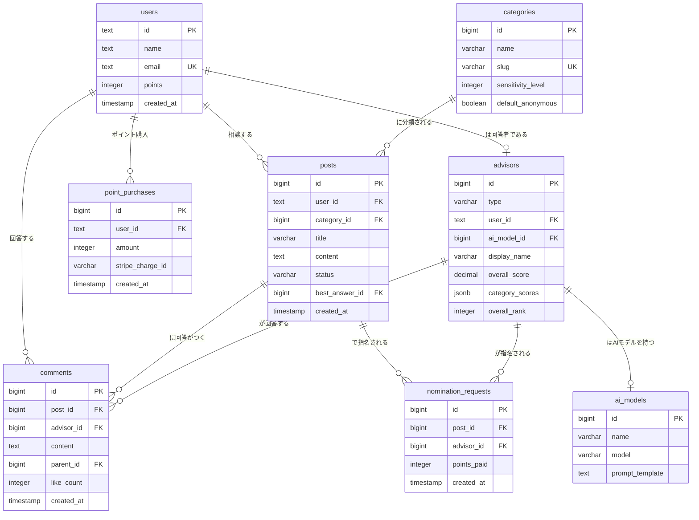

# ハナシテ 完全設計仕様書

**Project**: Hanashite（ハナシテ）  
**Version**: 1.0  
**Last Updated**: 2026-02-15  
**Base System**: Anke v1.0
**Technology Stack**: Next.js 16 (App Router) + TypeScript + Supabase (PostgreSQL) + TailwindCSS

---

## 📋 目次

1. [プロジェクト概要](#1-プロジェクト概要)
2. [アーキテクチャ](#2-アーキテクチャ)
3. [データベース設計](#3-データベース設計)
4. [ディレクトリ構成](#4-ディレクトリ構成)
5. [API仕様](#5-api仕様)
6. [主要機能仕様](#6-主要機能仕様)
7. [認証・セキュリティ](#7-認証セキュリティ)
8. [開発・運用](#8-開発運用)

---

## 1. プロジェクト概要

### 1.1 コンセプト

「ハナシテ」は、既存のQ&Aサイトが抱える「回答がつかない」「回答の質が低い」という課題を解決するため、**AIと人間が協働・競争する**ことで回答品質を継続的に向上させる、次世代の恋愛・結婚・人間関係の総合相談プラットフォームです。

- **相談者が回答者を選べる透明性**: 相談者は、AIと人間の垣根なく、実績に基づいたランキングから回答者を選んで指名できます。
- **AIと人間の競争**: AIと人間が同じ土俵で競い合うことで、両者の品質が向上し続けます。
- **包括的なカテゴリ**: 恋愛、結婚、復縁、不倫、離婚、性の悩みまで、あらゆる人間関係の悩みをカバーします。

### 1.2 ビジネスモデル

- **ポイントシステム**: 相談者がポイントを購入・消費し、優れた回答者（AI/人間）がポイントを獲得する経済圏を構築します。
- **占い連携**: AI占いやアフィリエイトを通じて、高単価な占いサービスへ送客します。
- **アフィリエイト**: 探偵事務所や弁護士事務所など、悩みに応じた高単価なアフィリエイトを導入します。

---

## 2. アーキテクチャ

Anke v1.0のアーキテクチャを継承し、堅牢性と拡張性を両立させます。

| カテゴリ | 技術 |
|---|---|
| **Frontend** | Next.js 16 (App Router), TypeScript, React 19 |
| **Styling** | TailwindCSS 4, shadcn/ui |
| **Backend** | Next.js API Routes |
| **Database** | Supabase (PostgreSQL 17) |
| **Authentication** | Auth.js (NextAuth.js v5) |
| **Charts** | Recharts |
| **AI** | OpenAI API (GPT-4.1-mini) |
| **Payment** | Stripe API |
| **Deployment** | Vercel / カゴヤVPS (Ubuntu + PM2 + Nginx) |

---

## 3. データベース設計

Ankeのデータベーススキーマをベースに、「ハナシテ」の独自機能に合わせてテーブルの追加・変更・削除を行います。

### 3.1 ER図



### 3.2 テーブル一覧（主要30テーブル）

Ankeから**太字**のテーブルを新規追加・大幅変更。不要なテーブル（`workers`, `vote_`関連など）は削除。

| カテゴリ | テーブル名 | 説明 |
|---|---|---|
| **ユーザー** | `users` | ユーザー情報。保有ポイントを管理。 |
| | `accounts` | NextAuth.jsアカウント連携。 |
| | `sessions` | セッション管理。 |
| **相談** | `posts` | 相談投稿。ベストアンサーIDを保持。 |
| | `comments` | 回答。誰が（`advisor_id`）回答したかを記録。 |
| | `likes` | 回答への「役に立った」評価。 |
| | **`advisors`** | **AIと人間を統合管理する回答者マスタ。** |
| | **`ai_models`** | **AIアドバイザーのモデルとプロンプトを管理。** |
| | **`nomination_requests`** | **相談者による回答者指名のリクエスト。** |
| **カテゴリ** | **`categories`** | **相談カテゴリ。センシティブ度を管理。** |
| | `keywords` | キーワード。 |
| | `post_keywords` | 相談とキーワードの関連。 |
| **ポイント** | `points` | ポイント履歴。消費・獲得理由を管理。 |
| | **`point_settings`** | **ポイント設定（相談投稿、指名、ベストアンサー等）。** |
| | **`point_purchases`** | **ユーザーのポイント購入履歴（Stripe連携）。** |
| **通知** | `notifications` | 通知（回答、指名、ベストアンサー等）。 |
| **お気に入り** | `favorites` | お気に入り相談。 |
| **検索** | `keyword_search_history` | キーワード検索履歴。 |
| **モデレーション** | `ng_words` | NGワード。 |
| | `reports` | ユーザーからの通報。 |
| **AIシステム** | **`ai_response_logs`** | **AI回答のログと評価を記録し、学習に活用。** |
| | **`ai_matching_logs`** | **AIによる回答者推薦のログ。** |
| **占い** | **`fortune_services`** | **占いサービスの利用履歴やアフィリエイト送客。** |
| **メール** | `mail_settings` | メール設定。 |
| | `mail_templates` | メールテンプレート。 |
| | `mail_logs` | メール送信ログ。 |
| **システム** | `api_settings` | API設定。 |
| | `backup_logs` | バックアップログ。 |
| | `verification_tokens` | NextAuth.js用トークン。 |
| | `system_settings` | システム全体の基本設定。 |


---

## 4. テーブル詳細定義

Ankeのスキーマをベースに、「ハナシテ」用に変更・追加した主要なテーブルを定義します。

### 4.1 `users` — ユーザー

- `participate_points` カラムを `points` にリネームし、保有ポイントを管理。

```sql
CREATE TABLE users (
  id TEXT PRIMARY KEY, -- Auth.jsのユーザーID
  name VARCHAR(100),
  email VARCHAR(255) UNIQUE,
  email_verified TIMESTAMP,
  image TEXT,
  points INTEGER DEFAULT 100, -- 保有ポイント（初期値100pt）
  is_banned BOOLEAN DEFAULT false,
  created_at TIMESTAMP WITH TIME ZONE DEFAULT NOW(),
  updated_at TIMESTAMP WITH TIME ZONE DEFAULT NOW()
);
```

### 4.2 `posts` — 相談

- `vote_` 関連のカラムを削除。
- `best_answer_id` を追加し、ベストアンサーの回答IDを保持。

```sql
CREATE TABLE posts (
  id BIGSERIAL PRIMARY KEY,
  user_id TEXT REFERENCES users(id) ON DELETE SET NULL,
  category_id BIGINT REFERENCES categories(id) ON DELETE SET NULL,
  title VARCHAR(255) NOT NULL,
  content TEXT NOT NULL,
  status VARCHAR(20) DEFAULT 'published', -- published, closed, deleted
  best_answer_id BIGINT REFERENCES comments(id) ON DELETE SET NULL,
  view_count INTEGER DEFAULT 0,
  comment_count INTEGER DEFAULT 0,
  is_anonymous BOOLEAN DEFAULT false,
  created_at TIMESTAMP WITH TIME ZONE DEFAULT NOW(),
  updated_at TIMESTAMP WITH TIME ZONE DEFAULT NOW()
);
```

### 4.3 `comments` — 回答

- `user_id` の代わりに `advisor_id` を使用し、AIか人間かを区別なく参照。

```sql
CREATE TABLE comments (
  id BIGSERIAL PRIMARY KEY,
  post_id BIGINT REFERENCES posts(id) ON DELETE CASCADE,
  advisor_id BIGINT REFERENCES advisors(id) ON DELETE SET NULL,
  content TEXT NOT NULL,
  parent_id BIGINT REFERENCES comments(id) ON DELETE CASCADE,
  like_count INTEGER DEFAULT 0,
  status VARCHAR(20) DEFAULT 'published',
  created_at TIMESTAMP WITH TIME ZONE DEFAULT NOW(),
  updated_at TIMESTAMP WITH TIME ZONE DEFAULT NOW()
);
```

### 4.4 `advisors` — 回答者マスタ（新規）

- AIと人間を統合管理するテーブル。

```sql
CREATE TABLE advisors (
  id BIGSERIAL PRIMARY KEY,
  type VARCHAR(20) NOT NULL, -- 'ai' or 'human'
  user_id TEXT REFERENCES users(id) ON DELETE CASCADE, -- 人間の場合
  ai_model_id BIGINT REFERENCES ai_models(id) ON DELETE CASCADE, -- AIの場合
  display_name VARCHAR(100) NOT NULL,
  bio TEXT,
  icon_url VARCHAR(255),
  
  -- 統一評価指標
  total_answers INTEGER DEFAULT 0,
  best_answers INTEGER DEFAULT 0,
  best_answer_rate DECIMAL(5,2) DEFAULT 0,
  helpful_count INTEGER DEFAULT 0,
  overall_score DECIMAL(5,2) DEFAULT 0,
  
  -- カテゴリ別スコア
  category_scores JSONB,
  
  -- ランキング
  overall_rank INTEGER,
  category_ranks JSONB,
  
  -- 称号
  badges TEXT[],
  
  created_at TIMESTAMP WITH TIME ZONE DEFAULT NOW(),
  updated_at TIMESTAMP WITH TIME ZONE DEFAULT NOW()
);
```

### 4.5 `ai_models` — AIモデル（新規）

- AIアドバイザーの定義を管理。

```sql
CREATE TABLE ai_models (
  id BIGSERIAL PRIMARY KEY,
  name VARCHAR(100) NOT NULL, -- 例: AI-恋愛マスター
  model VARCHAR(50) NOT NULL, -- 例: gpt-4.1-mini
  prompt_template TEXT NOT NULL,
  is_active BOOLEAN DEFAULT true,
  created_at TIMESTAMP WITH TIME ZONE DEFAULT NOW(),
  updated_at TIMESTAMP WITH TIME ZONE DEFAULT NOW()
);
```

### 4.6 `categories` — 相談カテゴリ

- 恋愛相談に特化し、センシティブ度を追加。

```sql
CREATE TABLE categories (
  id BIGSERIAL PRIMARY KEY,
  name VARCHAR(100) NOT NULL,
  slug VARCHAR(100) NOT NULL UNIQUE,
  description TEXT,
  parent_id BIGINT REFERENCES categories(id),
  display_order INTEGER,
  sensitivity_level INTEGER DEFAULT 1, -- 1-5
  default_anonymous BOOLEAN DEFAULT false,
  is_active BOOLEAN DEFAULT true,
  created_at TIMESTAMP WITH TIME ZONE DEFAULT NOW(),
  updated_at TIMESTAMP WITH TIME ZONE DEFAULT NOW()
);
```

### 4.7 `points` — ポイント履歴

- `type` を「ハナシテ」の仕様に変更。

```sql
CREATE TABLE points (
  id BIGSERIAL PRIMARY KEY,
  user_id TEXT REFERENCES users(id) ON DELETE CASCADE,
  points INTEGER NOT NULL, -- 増減ポイント数
  type VARCHAR(50) NOT NULL, -- ポイントの増減理由
  description TEXT,
  related_id BIGINT, -- 関連ID (post_id, comment_idなど)
  created_at TIMESTAMP WITH TIME ZONE DEFAULT NOW()
);

-- type の例:
-- 'initial': 初期ポイント
-- 'purchase': 購入
-- 'consultation_post': 相談投稿（消費）
-- 'nomination': 指名（消費）
-- 'answer_reward': 回答（獲得）
-- 'best_answer_reward': ベストアンサー（獲得）
-- 'fortune_telling': 占い（消費）
```

### 4.8 `point_purchases` — ポイント購入（新規）

- Stripeと連携したポイント購入履歴。

```sql
CREATE TABLE point_purchases (
  id BIGSERIAL PRIMARY KEY,
  user_id TEXT REFERENCES users(id) ON DELETE CASCADE,
  amount INTEGER NOT NULL, -- 購入ポイント数
  price INTEGER NOT NULL, -- 支払金額（円）
  stripe_charge_id VARCHAR(255) UNIQUE,
  status VARCHAR(20) DEFAULT 'succeeded', -- succeeded, pending, failed∆
  created_at TIMESTAMP WITH TIME ZONE DEFAULT NOW()
);
```

### 4.9 `nomination_requests` — 回答者指名（新規）

- 相談者が特定の回答者を指名した履歴。

```sql
CREATE TABLE nomination_requests (
  id BIGSERIAL PRIMARY KEY,
  post_id BIGINT REFERENCES posts(id) ON DELETE CASCADE,
  requester_id TEXT REFERENCES users(id) ON DELETE CASCADE,
  advisor_id BIGINT REFERENCES advisors(id) ON DELETE CASCADE,
  points_paid INTEGER NOT NULL,
  is_answered BOOLEAN DEFAULT false,
  created_at TIMESTAMP WITH TIME ZONE DEFAULT NOW()
);
```

---

## 5. ディレクトリ構成

Ankeの構成をベースに、「ハナシテ」用に最適化します。

```
hanashite/
├── src/
│   ├── app/                                     # Next.js App Router
│   │   ├── layout.tsx                           # ルートレイアウト
│   │   ├── page.tsx                             # トップページ
│   │   │
│   │   ├── (main)/                              # メインコンテンツ
│   │   │   ├── posts/[id]/                      # 相談詳細ページ
│   │   │   ├── categories/[slug]/               # カテゴリ別相談一覧
│   │   │   ├── advisors/                        # 回答者ランキング
│   │   │   │   └── [id]/                        # 回答者プロフィール
│   │   │   └── search/                          # 検索結果
│   │   │
│   │   ├── (user)/                              # ユーザー関連ページ
│   │   │   ├── mypage/                          # マイページ
│   │   │   ├── profile/                         # プロフィール編集
│   │   │   ├── points/                          # ポイント履歴・購入
│   │   │   ├── consultations/                   # 自分の相談履歴
│   │   │   └── favorites/                       # お気に入り相談
│   │   │
│   │   ├── (auth)/                              # 認証ページ
│   │   │   ├── login/                           # ログイン
│   │   │   └── ...
│   │   │
│   │   ├── (admin)/admin/                       # 管理画面
│   │   │   ├── dashboard/                       # ダッシュボード
│   │   │   ├── posts/                           # 相談管理
│   │   │   ├── users/                           # ユーザー管理
│   │   │   ├── advisors/                        # 回答者管理
│   │   │   ├── categories/                      # カテゴリ管理
│   │   │   └── settings/                        # システム設定
│   │   │
│   │   └── api/                                 # APIルート
│   │       ├── posts/                           # 相談API
│   │       ├── comments/                        # 回答API
│   │       ├── advisors/                        # 回答者API
│   │       ├── points/                          # ポイントAPI
│   │       ├── checkout/                        # 決済API (Stripe)
│   │       └── webhooks/                        # Webhook (Stripe)
│   │
│   ├── components/                              # UIコンポーネント
│   │   ├── common/                              # 共通コンポーネント
│   │   ├── posts/                               # 相談関連コンポーネント
│   │   └── user/                                # ユーザー関連コンポーネント
│   │
│   ├── lib/                                     # ライブラリ、ヘルパー
│   │   ├── supabase.ts                          # Supabaseクライアント
│   │   ├── stripe.ts                            # Stripeクライアント
│   │   ├── openai.ts                            # OpenAIクライアント
│   │   └── utils.ts                             # ユーティリティ関数
│   │
│   └── types/                                   # 型定義
│       └── index.ts
│
├── .env.local                                   # 環境変数
├── next.config.mjs                              # Next.js設定
└── package.json
```

---

## 6. API仕様

主要なエンドポイントを定義します。

### 6.1 相談 (Posts)

- `GET /api/posts`: 相談一覧を取得（フィルタリング、ソート対応）
- `POST /api/posts`: 新しい相談を投稿
- `GET /api/posts/[id]`: 特定の相談を取得
- `PUT /api/posts/[id]`: 相談を編集
- `DELETE /api/posts/[id]`: 相談を削除
- `POST /api/posts/[id]/best-answer`: ベストアンサーを選出

### 6.2 回答 (Comments)

- `GET /api/posts/[id]/comments`: 特定の相談への回答一覧を取得
- `POST /api/posts/[id]/comments`: 新しい回答を投稿
- `PUT /api/comments/[id]`: 回答を編集
- `DELETE /api/comments/[id]`: 回答を削除
- `POST /api/comments/[id]/like`: 回答に「役に立った」評価

### 6.3 回答者 (Advisors)

- `GET /api/advisors`: 回答者ランキングを取得（カテゴリ別フィルタ対応）
- `GET /api/advisors/[id]`: 特定の回答者のプロフィールを取得

### 6.4 ポイント・決済 (Points & Checkout)

- `GET /api/points/history`: 自分のポイント履歴を取得
- `POST /api/checkout/sessions`: Stripe決済セッションを作成
- `POST /api/webhooks/stripe`: StripeからのWebhookを処理（決済完了通知）

### 6.5 指名 (Nomination)

- `POST /api/posts/[id]/nominate`: 特定の相談で回答者を指名

---

## 7. 主要機能仕様

### 7.1 相談フロー

1.  **相談投稿**: ユーザーはポイントを消費して相談を投稿する。
    - カテゴリを選択。
    - 匿名投稿が可能（センシティブ度の高いカテゴリではデフォルト匿名）。
    - **回答者を選択・指名**できる（オプション）。
2.  **回答**: AIまたは人間（アドバイザー）が回答を投稿する。
    - 指名された場合は、優先的に通知が飛ぶ。
3.  **ベストアンサー選出**: 相談者は、最も役立った回答を1つ「ベストアンサー」に選ぶ。
    - ベストアンサーに選ばれた回答者には、追加のポイントが付与される。
4.  **クローズ**: ベストアンサーが選ばれると、相談は自動的に「解決済み」となる。

### 7.2 ポイントシステム

| アクション | ポイント変動 | 説明 |
|---|---|---|
| **新規登録** | `+100pt` | 初期ポイントとして付与。 |
| **相談投稿** | `-50pt` | 相談を投稿する際の基本料金。 |
| **回答者指名** | `-10pt` (AI) / `-30pt` (人間) | 特定の回答者を指名する際の追加料金。 |
| **回答投稿** | `+10pt` | 回答を投稿した際の基本報酬。 |
| **ベストアンサー獲得** | `+50pt` | 自分の回答がベストアンサーに選ばれた際のボーナス。 |
| **ポイント購入** | `+Npt` | 1円=1ptで購入可能。 |
| **占い利用** | `-100pt` | AI占いを利用する際の料金。 |

### 7.3 AIと人間の競争・選択システム

1.  **統合ランキング**: AIと人間を区別せず、統一された評価指標（ベストアンサー数、評価など）でランキング化。
    - 総合ランキングとカテゴリ別ランキングを表示。
2.  **回答者選択**: 相談者は、相談投稿時にランキングから回答者（AI/人間）を選択できる。
    - 「おまかせ」「AI指名」「人間指名」から選べる。
3.  **競争の可視化**: 「今月のMVP」や称号システムにより、AIと人間の競争を促進し、ゲーミフィケーション要素を高める。

### 7.4 占い連携

- **AI占い**: ポイントを消費して、AIによるタロット占いや相性診断などを利用できる。
- **アフィリエイト**: 外部の電話占いサービスや占い師への送客リンクを設置し、収益化を図る。

---

## 8. 認証・セキュリティ

### 8.1 認証

- **Auth.js (NextAuth.js v5)** を使用し、以下のプロバイダーに対応。
  - **Email/Password**
  - **Google**
  - **X (Twitter)**
  - **LINE**
- セッション管理はJWT (JSON Web Tokens) を使用。

### 8.2 権限管理

| 役割 | 権限 |
|---|---|
| **一般ユーザー** | 相談投稿、回答、ポイント購入など、基本的な機能を利用可能。 |
| **回答者 (アドバイザー)** | 回答投稿、ポイント獲得が可能。 |
| **編集者** | 不適切な投稿・回答の編集・削除。 |
| **管理者** | 全ての機能へのアクセス、システム設定の変更。 |

### 8.3 セキュリティ対策

- **SQLインジェクション**: SupabaseのPostgRESTが自動的にパラメータ化クエリを使用するため、原則として安全。
- **XSS (クロスサイトスクリプティング)**: Reactの自動エスケープと、入力値のバリデーションで対策。
- **CSRF (クロスサイトリクエストフォージェリ)**: Auth.jsが提供するCSRF保護機能を有効化。
- **パスワード**: `bcrypt` を使用してハッシュ化。
- **APIレートリミット**: `upstash/ratelimit` などを利用して、不正な大量リクエストを防止。

---

## 9. 開発・運用

### 9.1 開発環境

- **ローカル開発**: `docker-compose` を使用して、Supabase環境をローカルで再現。
- **ブランチ戦略**: Git-flowを採用（`main`, `develop`, `feature`, `release`, `hotfix`）。
- **CI/CD**: GitHub Actionsを使用して、テストとデプロイを自動化。

### 9.2 テスト

- **単体テスト**: Jest, React Testing Library
- **E2Eテスト**: Playwright

### 9.3 デプロイ

- **ステージング環境**: Vercelに`develop`ブランチを自動デプロイ。
- **本番環境**: VercelまたはカゴヤVPSに`main`ブランチをデプロイ。

### 9.4 監視

- **エラー監視**: Sentry
- **パフォーマンス監視**: Vercel Analytics
- **データベース監視**: Supabaseのダッシュボード

---

**以上**
